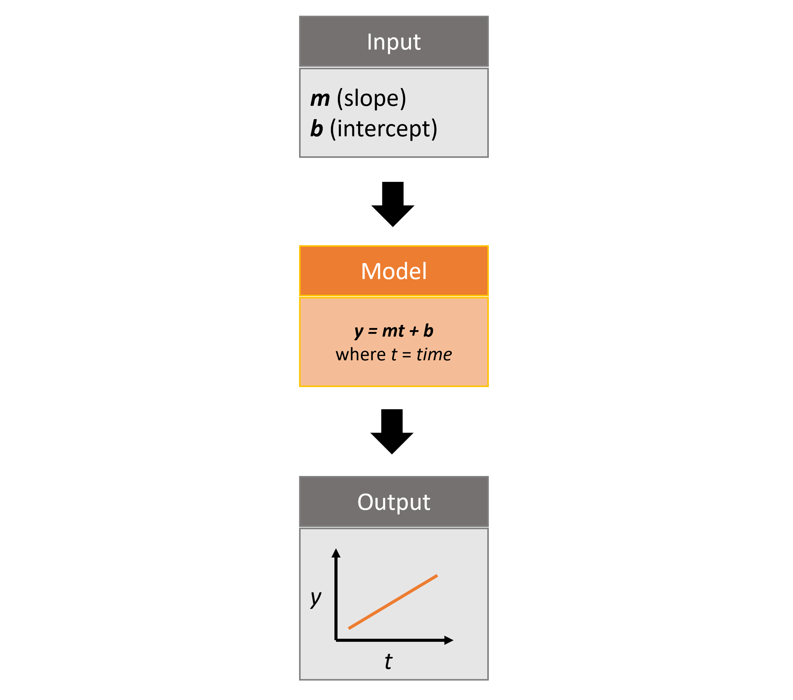
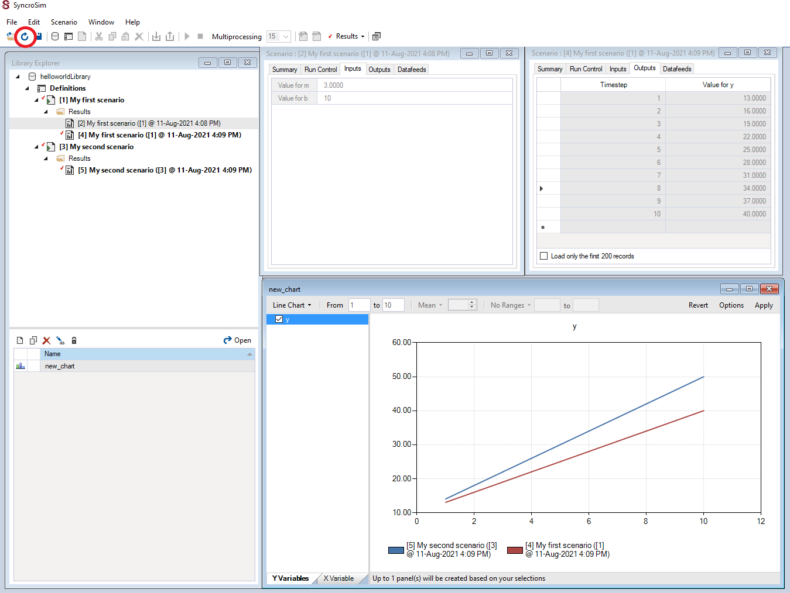

# Introduction to rsyncrosim

This vignette will cover the basics of using the `rsyncrosim` package
within the [SyncroSim](https://syncrosim.com/) software framework.

## Overview of SyncroSim

[SyncroSim](https://syncrosim.com/) is a software platform that helps
you turn your *data* into *forecasts*. At the core of SyncroSim is an
engine that automatically structures your existing data, regardless of
its original format. SyncroSim transforms this structured data into
forecasts by running it through a pipeline of calculations (i.e. a suite
of *models*). Finally, SyncroSim provides a rich interface to interact
with your data and models, allowing you to explore and track the
consequences of alternative “what-if” forecasting scenarios. Within this
software framework is the ability to use and create [SyncroSim
packages](https://docs.syncrosim.com/how_to_guides/package_overview.html).

For more details consult the SyncroSim [online
documentation](https://docs.syncrosim.com/).

## Overview of rsyncrosim

`rsyncrosim` is an R package designed to facilitate the development of
modeling workflows for the [SyncroSim](https://syncrosim.com/) software
framework. Using the `rsyncrosim` interface, simulation models can be
added and run through SyncroSim to transform scenario-based datasets
into model forecasts. This R package takes advantage of general features
of SyncroSim, such as defining scenarios with spatial or non-spatial
inputs, running Monte Carlo simulations, and summarizing model outputs.
`rsyncrosim` requires SyncroSim 2.2.13 or higher.

For more details consult the `rsyncrosim` [CRAN
documentation](https://cran.r-project.org/web/packages/rsyncrosim/index.html).

## SyncroSim package: `helloworldTime`

To demonstrate the utility of the `rsyncrosim` interface, we will be
using the [helloworldTime](https://github.com/ApexRMS/helloworldTime)
SyncroSim package. `helloworldTime` was designed to be a simple package
to introduce timesteps to SyncroSim modeling workflows.

The package takes from the user 2 inputs, *m* and *b*, representing a
slope and an intercept value. It then runs these input values through a
linear model, *y=mt+b*, where *t* is *time*, and returns the *y* value
as output.



Infographic of helloworldTime package

For more details on the different features of the `helloworldTime`
SyncroSim package, consult the SyncroSim [Enhancing a Package: Adding
Timesteps](https://docs.syncrosim.com/how_to_guides/package_create_timesteps.html)
tutorial.

## Setup

### Install SyncroSim

Before using `rsyncrosim` you will first need to [download and
install](https://syncrosim.com/download/) the SyncroSim software.
Versions of SyncroSim exist for both Windows and Linux.

*Note*: this tutorial was developed using `rsyncrosim` version 2.0. To
use `rsyncrosim` version 2.0 or greater, SyncroSim version 3.0 or
greater is required.

### Installing and loading R packages

You will need to install the `rsyncrosim` R package, either using
[CRAN](https://cran.r-project.org/) or from the `rsyncrosim` [GitHub
repository](https://github.com/syncrosim/rsyncrosim/releases/). Versions
of `rsyncrosim` are available for both Windows and Linux.

In a new R script, load the `rsyncrosim` package.

``` r
# Load R package for working with SyncroSim
library(rsyncrosim)
```

### Connecting R to SyncroSim using `session()`

The next step in setting up the R environment for the `rsyncrosim`
workflow is to create a SyncroSim session object in R that provides the
connection to your installed copy of the SyncroSim software. A new
session is created using the
[`session()`](https://syncrosim.github.io/rsyncrosim/reference/session.md)
function, in which the first argument is a path to the folder on your
computer where SyncroSim has been installed. If the first argument is
left blank, then the default install folder is used (Windows only).

``` r
mySession <- session("path/to/install_folder")      # Create a session based on SyncroSim install folder
mySession <- session()                              # Using default install folder (Windows only)
mySession                                           # Displays the session object
```

    ## class               : Session
    ## filepath [character]: C:\PROGRA~1\SYNCRO~1
    ## silent [logical]    : TRUE
    ## printCmd [logical]  : FALSE
    ## condaFilepath [NULL]:

You can check to see which version of SyncroSim your R script is
connected to by running the
[`version()`](https://syncrosim.github.io/rsyncrosim/reference/version.md)
function.

``` r
version(mySession)
```

    ## [1] "3.1.27"

### Installing SyncroSim packages using `installPackage()`

Finally, check if the
[helloworldTime](https://github.com/ApexRMS/helloworldTime) package is
already installed. Use the
[`packages()`](https://syncrosim.github.io/rsyncrosim/reference/packages.md)
function from `rsyncrosim` to first get a list of all currently
installed packages in SyncroSim.

``` r
# Get list of installed packages
packages()
```

    ## [1] name        version     description location    status     
    ## <0 rows> (or 0-length row.names)

Currently we do not have any packages installed! To see which packages
are available from the SyncroSim package server, you can use the
`installed = FALSE` argument in the
[`packages()`](https://syncrosim.github.io/rsyncrosim/reference/packages.md)
function.

``` r
availablePackages <- packages(installed = FALSE)
head(availablePackages)
```

    ##                   name version                                      description
    ## 1           burnP3Plus   2.3.0   Burn-P3+ package for burn probability modeling
    ## 2  burnP3PlusCell2Fire   2.2.0  Cell2Fire fire growth model package for BurnP3+
    ## 3  burnP3PlusFireSTARR   1.2.0  FireSTARR fire growth model package for BurnP3+
    ## 4 burnP3PlusPrometheus   2.2.0 Prometheus fire growth model package for BurnP3+
    ## 5            demosales   2.1.0                     Demo Sales SyncroSim Package
    ## 6                dgsim   3.1.0   Simulates demographics of wildlife populations
    ##                                    url
    ## 1 https://burnp3.github.io/BurnP3Plus/
    ## 2 https://burnp3.github.io/BurnP3Plus/
    ## 3 https://burnp3.github.io/BurnP3Plus/
    ## 4 https://burnp3.github.io/BurnP3Plus/
    ## 5 https://apexrms.github.io/demosales/
    ## 6     https://apexrms.github.io/dgsim/

Install `helloworldTime` using the `rynscrosim` function
[`installPackage()`](https://syncrosim.github.io/rsyncrosim/reference/installPackage.md).
This function takes a package name as input and then queries the
SyncroSim package server for the specified package.

``` r
# Install helloworldTime
installPackage("helloworldTime")
```

    ## Package <helloworldTime v2.1.1> installed

To install the package from a `.ssimpkg` file on your local computer
rather than installing directly from the server, you can use the
[`addPackage()`](https://syncrosim.github.io/rsyncrosim/reference/addPackage.md)
function with the file path to the `.ssimpkg`, rather than using the
package name as the argument.

``` r
# Install helloworldTime using file path to ssimpkg file
installPackage("path/to/helloworldTime.ssimpkg")
```

Now `helloworldTime` should be included in the package list:

``` r
# Get list of installed packages
packages()
```

    ##             name version
    ## 1 helloworldTime   2.1.1
    ##                                                  description
    ## 1 Example demonstrating how to use timesteps with an R model
    ##                                                                            location
    ## 1 C:\\Users\\VickiZhang\\AppData\\Local\\SyncroSim\\Packages\\helloworldTime\\2.1.1
    ##   status
    ## 1     OK

*Note:* you can install multiple versions of the same package using the
[`installPackage()`](https://syncrosim.github.io/rsyncrosim/reference/installPackage.md)
function and specifying the `version` argument. You can also uninstall
packages using the
[`uninstallPackage()`](https://syncrosim.github.io/rsyncrosim/reference/uninstallPackage.md)
function in `rsyncrosim`.

## Create a modeling workflow

When creating a new modeling workflow from scratch, we need to create
objects of the following scopes:

- [Library](https://docs.syncrosim.com/how_to_guides/library_overview.html)
- [Projects](https://docs.syncrosim.com/how_to_guides/library_overview.html)
- [Scenarios](https://docs.syncrosim.com/how_to_guides/library_overview.html)

These objects are hierarchical, such that a library can contain many
projects, and each project can contain many scenarios. All parameters or
configurations set in a library are inherited by all projects within the
library, and all parameters or configurations set in a project are
inherited by all scenarios within that project. See below for further
information on these SyncroSim objects.

### Create a new library using `ssimLibrary()`

A SyncroSim
[library](https://docs.syncrosim.com/how_to_guides/library_overview.html)
is a file (with `.ssim` extension) that stores all of your model inputs
and outputs. The format of each SyncroSim library is unique to the
SyncroSim package with which it is associated. We use the
[`ssimLibrary()`](https://syncrosim.github.io/rsyncrosim/reference/ssimLibrary.md)
function to create a new *SsimLibrary* object in R that is connected
(through your session) to a SyncroSim library file.

``` r
# Create a new library
myLibrary <- ssimLibrary(name = "helloworldLibrary.ssim",
                         session = mySession,
                         packages = "helloworldTime")

# Check library information
myLibrary
```

    ## Package <helloworldTime v2.1.1> added

    ## class                      : SsimLibrary
    ## session [Session]          : C:\PROGRA~1\SYNCRO~1, printCmd=FALSE
    ## filepath [character]       : path/to/helloworldLibrary.ssim
    ## datasheetNames [data.frame]: scope,package,name,displayName,isSingle,displayMember

*Note:* if you have SyncroSim installed in the default location, you do
not need to specify the `session` argument when creating or loading a
library. However, if you have SyncroSim installed in a non-default
location, then you must include the `session` argument when creating or
loading a library and making any subsequent calls to your library.

We can also use the
[`ssimLibrary()`](https://syncrosim.github.io/rsyncrosim/reference/ssimLibrary.md)
function to open an existing library. For instance, now that we have
created a library called “helloworldLibrary.ssim”, we would simply
specify that we want to open this library using the `name` argument. The
`name` argument takes the path to the SyncroSim library *.ssim* file
that you would like to open. Since “helloworldLibrary” is in our working
directory we do not need to specify the full path to this library.

``` r
# Open existing library
myLibrary <- ssimLibrary(name = "helloworldLibrary.ssim")
```

*Note*: if you want to create a new library file with an existing
library name rather than opening the existing library, you can use
`overwrite=TRUE` in the
[`ssimLibrary()`](https://syncrosim.github.io/rsyncrosim/reference/ssimLibrary.md)
function.

### Open a project using `project()`

Each SyncroSim library contains one or more SyncroSim
[projects](https://docs.syncrosim.com/how_to_guides/library_overview.html),
each represented by a *Project* object in R. Projects typically store
model inputs that are common to all your scenarios. In most situations
you will need only a single project for your library; by default each
new library starts with a single project named “Definitions” (with a
unique `projectId`= 1). The
[`project()`](https://syncrosim.github.io/rsyncrosim/reference/project.md)
function is used to both create and retrieve projects. Note that the
`ssimObject` here can be the name of a library or scenario.

``` r
# Open existing project
myProject = project(ssimObject = myLibrary, project = "Definitions")  # Using name for project
myProject = project(ssimObject = myLibrary, project = 1)              # Using projectId for project

# Check project information
myProject
```

    ## class                      : Project
    ## projectId [numeric]        : 1
    ## session [Session]          : C:\PROGRA~1\SYNCRO~1, printCmd=FALSE
    ## filepath [character]       : path/to/helloworldLibrary.ssim
    ## datasheetNames [data.frame]: scope,package,name,displayName,isSingle,displayMember

### Create a new scenario using `scenario()`

Finally, each SyncroSim project contains one or more
[scenarios](https://docs.syncrosim.com/how_to_guides/library_overview.html),
each represented by a *Scenario* object in R.

Scenarios store the specific inputs and outputs associated with each
transformer in SyncroSim. SyncroSim models can be broken down into one
or more of these transformers. Each transformer essentially runs a
series of calculations on the input data to *transform* it into the
output data. Scenarios can contain multiple transformers connected by a
series of pipelines, such that the output of one transformer becomes the
input of the next.

Each scenario can be identified by its unique `scenarioId`. The
[`scenario()`](https://syncrosim.github.io/rsyncrosim/reference/scenario.md)
function is used to both create and retrieve scenarios. Note that the
`ssimObject` here can be the name of a library or a project.

``` r
# Create a new scenario (associated with the default project)
myScenario = scenario(ssimObject = myProject, scenario = "My first scenario")

# Check scenario information
myScenario
```

    ## class                      : Scenario
    ## projectId [numeric]        : 1
    ## scenarioId [numeric]       : 1
    ## parentId [numeric]         : 0
    ## folderId [numeric]         : 0
    ## session [Session]          : C:\PROGRA~1\SYNCRO~1, printCmd=FALSE
    ## filepath [character]       : path/to/helloworldLibrary.ssim
    ## datasheetNames [data.frame]: scope,package,name,displayName,isSingle,displayMember

### View model inputs using `datasheet()`

Each SyncroSim library contains multiple SyncroSim
[datasheets](https://docs.syncrosim.com/how_to_guides/properties_overview.html).
A SyncroSim datasheet is simply a table of data stored in the library,
and they represent the input and output data for transformers.
Datasheets each have a *scope*: either
[library](https://docs.syncrosim.com/how_to_guides/library_overview.html),
[project](https://docs.syncrosim.com/how_to_guides/library_overview.html),
or
[scenario](https://docs.syncrosim.com/how_to_guides/library_overview.html).
Datasheets with a library scope represent data that is specified only
once for the entire library, such as the location of the backup folder.
Datasheets with a project scope represent data that are shared over all
scenarios within a project. Datasheets with a scenario scope represent
data that must be specified for each generated scenario. We can view
datasheets of varying scopes using the
[`datasheet()`](https://syncrosim.github.io/rsyncrosim/reference/datasheet.md)
function from `rsyncrosim`.

``` r
# View all Datasheets associated with a library, project, or scenario
datasheet(myScenario)
```

    ##       scope                           name             displayName
    ## 26 scenario         core_DistributionValue           Distributions
    ## 27 scenario     core_ExternalVariableValue      External Variables
    ## 28 scenario                  core_Pipeline                Pipeline
    ## 29 scenario    core_SpatialMultiprocessing Spatial Multiprocessing
    ## 30 scenario  helloworldTime_InputDatasheet                  Inputs
    ## 31 scenario helloworldTime_OutputDatasheet                 Outputs
    ## 32 scenario      helloworldTime_RunControl             Run Control

If we want to see more information about each datasheet, such as the
scope of the datasheet or if it only accepts a single row of data, we
can set the `optional` argument to `TRUE`.

``` r
datasheet(myScenario, optional = TRUE)
```

    ##       scope        package                           name
    ## 5  scenario           core         core_DistributionValue
    ## 7  scenario           core     core_ExternalVariableValue
    ## 15 scenario           core                  core_Pipeline
    ## 22 scenario           core    core_SpatialMultiprocessing
    ## 30 scenario helloworldTime  helloworldTime_InputDatasheet
    ## 31 scenario helloworldTime helloworldTime_OutputDatasheet
    ## 32 scenario helloworldTime      helloworldTime_RunControl
    ##                displayName isSingle displayMember  data scenario
    ## 5            Distributions    FALSE           N/A FALSE        1
    ## 7       External Variables    FALSE           N/A FALSE        1
    ## 15                Pipeline    FALSE           N/A FALSE        1
    ## 22 Spatial Multiprocessing     TRUE           N/A FALSE        1
    ## 30                  Inputs     TRUE           N/A FALSE        1
    ## 31                 Outputs    FALSE           N/A FALSE        1
    ## 32             Run Control     TRUE           N/A FALSE        1

From this output we can see the the `Run Control` and `Inputs`
datasheets only accept a single row of data (i.e. `isSingle = TRUE`).
This is something to consider when we configure our model inputs.

To view a specific datasheet rather than just a data frame of available
datasheets, set the `name` parameter in the
[`datasheet()`](https://syncrosim.github.io/rsyncrosim/reference/datasheet.md)
function to the name of the datasheet you want to view. The general
syntax of the name is: “\<name of package\>\_\<name of Datasheet\>“.
From the list of datasheets above, we can see that there are 3
datasheets specific to the `helloworldTime` package.

``` r
# View the Inputs datasheet for the scenario
datasheet(myScenario, name = "helloworldTime_InputDatasheet")
```

    ## [1] m b
    ## <0 rows> (or 0-length row.names)

Here, we are viewing the contents of a SyncroSim datasheet as an R data
frame. Although both SyncroSim datasheets and R data frames are both
represented as tables of data with predefined columns and an unlimited
number of rows, the underlying structure of these tables differ.

### Configure model inputs using `datasheet()` and `addRow()`

Currently our `Inputs` scenario datasheet is empty! We will need to add
some values to the `Inputs` datasheet (`InputDatasheet`) so we can run
our model.

First, assign the `Inputs` datasheet to a new data frame variable.

``` r
# Assign contents of the Inputs datasheet to an R data frame
myInputDataframe <- datasheet(myScenario,
                              name = "helloworldTime_InputDatasheet")
```

Check the columns that need input values and the type of values these
columns require (e.g. string, numeric, logical) using the
[`str()`](https://rdrr.io/r/utils/str.html) base R function. This
function will also let us know if certain columns are factors with
specific acceptable values.

``` r
# Check the columns of the input data frame
str(myInputDataframe)
```

    ## 'data.frame':    0 obs. of  2 variables:
    ##  $ m: num 
    ##  $ b: num

The `Inputs` datasheet requires 2 values:

- `m` : the slope of the linear equation.
- `b` : the intercept of the linear equation.

Now, we will update the `Inputs` data frame. This can be done in many
ways (e.g. using the `dplyr` package), but `rsyncrosim` also provides a
helper function called
[`addRow()`](https://syncrosim.github.io/rsyncrosim/reference/addRow.md)
for easily adding new rows to R data frames. The
[`addRow()`](https://syncrosim.github.io/rsyncrosim/reference/addRow.md)
function takes the `targetDataframe` as the first value (in this case,
our `Inputs` data frame that we want to update), and the data frame of
new rows to append to the input data frame as the second value.

``` r
# Create input data and add it to the input data frame
myInputRow <- data.frame(m = 3, b = 10)
myInputDataframe <- addRow(myInputDataframe, myInputRow)

# Check values
myInputDataframe
```

    ##   m  b
    ## 1 3 10

### Saving modifications to datasheets using `saveDatasheet()`

Now that we have a complete data frame of the `Inputs`, we will save
this data frame to its respective SyncroSim datasheets using the
[`saveDatasheet()`](https://syncrosim.github.io/rsyncrosim/reference/saveDatasheet.md)
function. Since this datasheet is scenario-scoped, we will save it at
the scenario level by setting `ssimObject = myScenario`.

``` r
# Save Inputs R data frame to a SyncroSim datasheet
saveDatasheet(ssimObject = myScenario, data = myInputDataframe,
              name = "helloworldTime_InputDatasheet")
```

    ## Datasheet <helloworldTime_InputDatasheet> saved

### Configuring the `Pipeline` datasheet

Next, we need to add data to the `Pipeline` datasheet. The `Pipeline`
datasheet is a built-in SyncroSim datasheet, meaning that it comes with
every SyncroSim library regardless of which packages that library
uses.The `Pipeline` datasheet determines which transformer stage the
scenarios will run and in which order. We use the term “transformers”
because these constitute scripts that *transform* input data into output
data. Use the code below to assign the `Pipeline` datasheet to a new
data frame variable and check the values required by the datasheet.

``` r
# Assign contents of the Pipeline datasheet to an R data frame
myPipeline <- datasheet(myScenario,
                        name = "core_Pipeline")

# Check the columns of the Pipeline data frame
str(myPipeline)
```

    ## 'data.frame':    0 obs. of  2 variables:
    ##  $ StageNameId: Factor w/ 1 level "Hello World Time (R)": 
    ##  $ RunOrder   : num

The Pipeline datasheet requires 2 values:

- `StageNameId` : the pipeline transformer stage. This column is a
  factor that has only a single level: “Hello World Time (R)”.
- `RunOrder` : the numerical order in which the stages will be run.

Below, we use the
[`addRow()`](https://syncrosim.github.io/rsyncrosim/reference/addRow.md)
and
[`saveDatasheet()`](https://syncrosim.github.io/rsyncrosim/reference/saveDatasheet.md)
functions to update the `Pipeline` datasheet with the transformer(s) we
want to run and the order in which we want to run them. In this case,
there is only a single transformer available from the `helloworldTime`
package, called “Hello World Time (R)”, so we will add this transformer
to the data frame and set the `RunOrder` to `1`.

``` r
# Create Pipeline data and add it to the Pipeline data frame
myPipelineRow <- data.frame(StageNameId = "Hello World Time (R)", RunOrder = 1)
myPipeline <- addRow(myPipeline, myPipelineRow)

# Check values
myPipeline
```

    ##            StageNameId RunOrder
    ## 1 Hello World Time (R)        1

``` r
# Save Pipeline R data frame to a SyncroSim Datasheet
saveDatasheet(ssimObject = myScenario, 
              data = myPipeline,
              name = "core_Pipeline")
```

    ## Datasheet <core_Pipeline> saved

### Configuring the `Run Control` datasheet

There is one other datasheet that we need to configure for our package
to run. The `Run Control` datasheet provides information about how many
timesteps to use in the model. Here, we set the minimum and maximum
timesteps for our model. We’ll add this information to an R data frame
and then add it to the Run Control datasheet using
[`addRow()`](https://syncrosim.github.io/rsyncrosim/reference/addRow.md).
We need to specify data for the following 2 columns:

- `MinimumTimestep` : the starting time point of the simulation.
- `MaximumTimestep` : the end time point of the simulation.

``` r
# Assign contents of the run control datasheet to an R data frame
runSettings <- datasheet(myScenario, name = "helloworldTime_RunControl")

# Check the columns of the run control data frame
str(runSettings)
```

    ## 'data.frame':    0 obs. of  2 variables:
    ##  $ MinimumTimestep: num 
    ##  $ MaximumTimestep: num

``` r
# Create run control data and add it to the run control data frame
runSettingsRow <- data.frame(MinimumTimestep = 1,
                             MaximumTimestep = 10)
runSettings <- addRow(runSettings, runSettingsRow)

# Check values
runSettings
```

    ##   MinimumTimestep MaximumTimestep
    ## 1               1              10

``` r
# Save run control R data frame to a SyncroSim datasheet
saveDatasheet(ssimObject = myScenario, data = runSettings,
              name = "helloworldTime_RunControl")
```

    ## Datasheet <helloworldTime_RunControl> saved

## Run scenarios

### Setting the number of multiprocessing jobs

To set the number of multiprocessing jobs for a scenario run, we need to
modify the library-scoped “core_Multiprocessing” datasheet.

``` r
# Open the multiprocessing datasheet
mpSettings <- datasheet(myLibrary, name = "core_Multiprocessing")
```

    ## [1] "Note: MaximumJobs should be between 1 and 9999"

``` r
# Set the maximum number of jobs to 4
mpSettings$MaximumJobs <- 4

# Save the datasheet back to the library
saveDatasheet(myLibrary, mpSettings, name = "core_Multiprocessing")
```

    ## Datasheet <core_Multiprocessing> saved

### Setting run parameters with `run()`

We will now run our scenarios using the
[`run()`](https://syncrosim.github.io/rsyncrosim/reference/run.md)
function in `rsyncrosim`, starting with the first scenario we created
(“My first scenario”).

``` r
# Run the first scenario we created
myResultScenario <- run(myScenario)
```

    ## [1] "Running scenario [1] My first scenario"

    ## This model uses Conda environments, but no Conda installation was found. Using local environment.

### Checking the run log with `runLog()`

For more information use the
[`runLog()`](https://syncrosim.github.io/rsyncrosim/reference/runLog.md)
function, in which the only argument is the result scenario variable.

``` r
# Get run details for the first result scenario
runLog(myResultScenario)
```

    ## RunLog                                                                                              
    ## SyncroSim Version: 3.1.27.0                                                                         
    ## Operating System: Microsoft Windows 11 Pro (Microsoft Windows NT 6.2.9200.0)                        
    ##                                                                                                     
    ## Packages:                                                                                           
    ## core -> 3.1.27                                                                                      
    ## helloworldTime -> 2.1.1                                                                             
    ##                                                                                                     
    ## Parent Scenario is: [1] My first scenario                                                           
    ## Result scenario is: [2] My first scenario ([1] @ 10-Mar-2026 5:20 PM)                               
    ##                                                                                                     
    ## --------------------------------------------                                                        
    ## STARTING SIMULATION: 2026-03-10 : 5:20:26 PM                                                        
    ## --------------------------------------------                                                        
    ##                                                                                                     
    ## START TRANSFORMER: Hello World Time (R)                                                             
    ##                                                                                                     
    ## This Library is capable of using conda environments, but the 'Use conda' property is disabled.      
    ## To enable conda, refer to https://docs.syncrosim.com/getting_started/quickstart_conda.html          
    ##                                                                                                     
    ## Hello World Time (R) post processing => Total time: 00:00:00                                        
    ## Hello World Time (R) saving results => Total time: 00:00:00                                         
    ## Hello World Time (R) Total time: 00:00:12                                                           
    ## END TRANSFORMER: Hello World Time (R)                                                               
    ##                                                                                                     
    ## --------------------------------------------                                                        
    ## SIMULATION COMPLETE: 2026-03-10 : 5:20:39 PM                                                        
    ## --------------------------------------------                                                        
    ## Total simulation time: 00:00:13

    ## [1] "RunLog                                                                                              \nSyncroSim Version: 3.1.27.0                                                                         \nOperating System: Microsoft Windows 11 Pro (Microsoft Windows NT 6.2.9200.0)                        \n                                                                                                    \nPackages:                                                                                           \ncore -> 3.1.27                                                                                      \nhelloworldTime -> 2.1.1                                                                             \n                                                                                                    \nParent Scenario is: [1] My first scenario                                                           \nResult scenario is: [2] My first scenario ([1] @ 10-Mar-2026 5:20 PM)                               \n                                                                                                    \n--------------------------------------------                                                        \nSTARTING SIMULATION: 2026-03-10 : 5:20:26 PM                                                        \n--------------------------------------------                                                        \n                                                                                                    \nSTART TRANSFORMER: Hello World Time (R)                                                             \n                                                                                                    \nThis Library is capable of using conda environments, but the 'Use conda' property is disabled.      \nTo enable conda, refer to https://docs.syncrosim.com/getting_started/quickstart_conda.html          \n                                                                                                    \nHello World Time (R) post processing => Total time: 00:00:00                                        \nHello World Time (R) saving results => Total time: 00:00:00                                         \nHello World Time (R) Total time: 00:00:12                                                           \nEND TRANSFORMER: Hello World Time (R)                                                               \n                                                                                                    \n--------------------------------------------                                                        \nSIMULATION COMPLETE: 2026-03-10 : 5:20:39 PM                                                        \n--------------------------------------------                                                        \nTotal simulation time: 00:00:13                                                                     "

*Note*: if your scenario fails to run, it will still produce a *result
scenario* that you can use the
[`runLog()`](https://syncrosim.github.io/rsyncrosim/reference/runLog.md)
function on to see more information about why the run failed.

## View results

### Result scenarios

A *result scenario* is generated when a scenario is run, and is an exact
copy of the original scenario (i.e. it contains the original scenario’s
values for all `Inputs` datasheets). The result scenario is passed to
the transformer in order to generate model output, with the results of
the transformer’s calculations then being added to the result scenario
as output datasheets. In this way the result scenario contains both the
output of the run and a snapshot record of all the model inputs.

Check out the current scenarios in your library using the
[`scenario()`](https://syncrosim.github.io/rsyncrosim/reference/scenario.md)
function.

``` r
# Check scenarios that currently exist in your library
scenario(myLibrary)
```

    ##   ScenarioId ProjectId ParentId                                          Name
    ## 1          1         1       NA                             My first scenario
    ## 2          2         1        1 My first scenario ([1] @ 10-Mar-2026 5:20 PM)
    ##   Owner MergeDependencies IgnoreDependencies IsResult IsReadOnly
    ## 1   N/A                No                 NA       No         No
    ## 2   N/A                No                 NA      Yes         No
    ##        DateLastModified
    ## 1 2026-03-10 at 5:20 PM
    ## 2 2026-03-10 at 5:20 PM

The first scenario is our original scenario, and the second is the
result scenario with a time and date stamp of when it was run. We can
also see some other information about these scenarios, such as whether
or not the scenario is a result or not (i.e. `isResult` column).

We can also look at how the datasheets differ between the result
scenario and the original scenario using the
[`datasheet()`](https://syncrosim.github.io/rsyncrosim/reference/datasheet.md)
function.

``` r
# Take a look at original scenario datasheets
datasheet(myScenario, optional = TRUE)
```

    ##       scope        package                           name
    ## 5  scenario           core         core_DistributionValue
    ## 7  scenario           core     core_ExternalVariableValue
    ## 15 scenario           core                  core_Pipeline
    ## 22 scenario           core    core_SpatialMultiprocessing
    ## 30 scenario helloworldTime  helloworldTime_InputDatasheet
    ## 31 scenario helloworldTime helloworldTime_OutputDatasheet
    ## 32 scenario helloworldTime      helloworldTime_RunControl
    ##                displayName isSingle displayMember  data scenario
    ## 5            Distributions    FALSE           N/A FALSE        1
    ## 7       External Variables    FALSE           N/A FALSE        1
    ## 15                Pipeline    FALSE           N/A  TRUE        1
    ## 22 Spatial Multiprocessing     TRUE           N/A FALSE        1
    ## 30                  Inputs     TRUE           N/A  TRUE        1
    ## 31                 Outputs    FALSE           N/A FALSE        1
    ## 32             Run Control     TRUE           N/A  TRUE        1

``` r
# Take a look at result scenario datasheets
datasheet(myResultScenario, optional = TRUE)
```

    ##       scope        package                           name
    ## 5  scenario           core         core_DistributionValue
    ## 7  scenario           core     core_ExternalVariableValue
    ## 15 scenario           core                  core_Pipeline
    ## 22 scenario           core    core_SpatialMultiprocessing
    ## 30 scenario helloworldTime  helloworldTime_InputDatasheet
    ## 31 scenario helloworldTime helloworldTime_OutputDatasheet
    ## 32 scenario helloworldTime      helloworldTime_RunControl
    ##                displayName isSingle displayMember  data scenario
    ## 5            Distributions    FALSE           N/A FALSE        1
    ## 7       External Variables    FALSE           N/A FALSE        1
    ## 15                Pipeline    FALSE           N/A  TRUE        1
    ## 22 Spatial Multiprocessing     TRUE           N/A FALSE        1
    ## 30                  Inputs     TRUE           N/A  TRUE        1
    ## 31                 Outputs    FALSE           N/A  TRUE        1
    ## 32             Run Control     TRUE           N/A  TRUE        1

Looking at the `data` column, the `Outputs` does not contain any data in
the original scenario, but does in the result scenario.

### Viewing results with `datasheet()`

The next step is to view the `Outputs` datasheet in the result scenario
that was populated from running the original scenario. We can load the
result table using the
[`datasheet()`](https://syncrosim.github.io/rsyncrosim/reference/datasheet.md)
function and setting the `name` parameter to the `Outputs` datasheet.

``` r
# Results of first scenario
myOutputDataframe <- datasheet(myResultScenario,
                               name = "helloworldTime_OutputDatasheet")

# View results table
head(myOutputDataframe)
```

    ##   Timestep  y
    ## 1        1 13
    ## 2        2 16
    ## 3        3 19
    ## 4        4 22
    ## 5        5 25
    ## 6        6 28

## Working with multiple scenarios

You may want to compare multiple alternative scenarios that have
slightly different inputs. To save time, you can copy a scenario that
you’ve already made, give it a different name, and modify the inputs. To
copy a completed scenario, use the
[`scenario()`](https://syncrosim.github.io/rsyncrosim/reference/scenario.md)
function with the `sourceScenario` argument set to the name of the
scenario you want to copy.

``` r
# Check which scenarios you currently have in your library
scenario(myLibrary)['Name']
```

    ##                                            Name
    ## 1                             My first scenario
    ## 2 My first scenario ([1] @ 10-Mar-2026 5:20 PM)

``` r
# Create a new scenario as a copy of an existing scenario
myNewScenario <- scenario(ssimObject = myProject,
                          scenario = "My second scenario",
                          sourceScenario = myScenario)

# Make sure this new scenario has been added to the library
scenario(myLibrary)['Name']
```

    ##                                            Name
    ## 1                             My first scenario
    ## 2 My first scenario ([1] @ 10-Mar-2026 5:20 PM)
    ## 3                            My second scenario

To edit the new scenario, we must first load the contents of the
`Inputs` datasheet and assign it to a new R data frame using the
[`datasheet()`](https://syncrosim.github.io/rsyncrosim/reference/datasheet.md)
function. We will set the `empty` argument to `TRUE` so that instead of
getting the values from the existing scenario, we can start with an
empty data frame again.

``` r
# Load empty Inputs datasheets as an R data frame
myNewInputDataframe <- datasheet(myNewScenario,
                                 name = "helloworldTime_InputDatasheet",
                                 empty=TRUE)

# Check that we have an empty data frame
str(myNewInputDataframe)
```

    ## 'data.frame':    0 obs. of  2 variables:
    ##  $ m: num 
    ##  $ b: num

Now, all we need to do is add our data frame of values the same way we
did before, using the
[`addRow()`](https://syncrosim.github.io/rsyncrosim/reference/addRow.md)
function.

``` r
# Create input data and add it to the input data frame
newInputRow <- data.frame(m = 4, b = 10)
myNewInputDataframe <- addRow(myNewInputDataframe, newInputRow)

# View the new inputs
myNewInputDataframe
```

    ##   m  b
    ## 1 4 10

Finally, we will save the updated data frame to a SyncroSim datasheet
using
[`saveDatasheet()`](https://syncrosim.github.io/rsyncrosim/reference/saveDatasheet.md).

``` r
# Save R data frame to a SyncroSim datasheet
saveDatasheet(ssimObject = myNewScenario, 
              data = myNewInputDataframe,
              name = "helloworldTime_InputDatasheet")
```

    ## Datasheet <helloworldTime_InputDatasheet> saved

We will keep the `Run Control` datasheet the same as the first scenario.

### Run scenarios

We now have two SyncroSim scenarios. We can run all the scenarios in our
project at once by telling
[`run()`](https://syncrosim.github.io/rsyncrosim/reference/run.md) which
project to use and including a vector of scenarios in the `scenario`
argument.

``` r
# Run all scenarios
myResultScenarioAll <- run(myProject,
                           scenario = c("My first scenario",
                                        "My second scenario"))
```

    ## [1] "Running scenario [1] My first scenario"

    ## This model uses Conda environments, but no Conda installation was found. Using local environment.

    ## [1] "Running scenario [3] My second scenario"

    ## This model uses Conda environments, but no Conda installation was found. Using local environment.

### View results

The output that is returned from running many scenarios at once is
actually a list of result scenario objects. To view the results, we can
still use the
[`datasheet()`](https://syncrosim.github.io/rsyncrosim/reference/datasheet.md)
function, we just need to index for the result scenario object we are
interested in.

``` r
datasheet(myResultScenarioAll[2], name = "helloworldTime_OutputDatasheet")
```

    ##    Timestep  y
    ## 1         1 14
    ## 2         2 18
    ## 3         3 22
    ## 4         4 26
    ## 5         5 30
    ## 6         6 34
    ## 7         7 38
    ## 8         8 42
    ## 9         9 46
    ## 10       10 50

### Identifying the parent scenario of a result scenario using `parentId()`

If you have many alternative scenarios and many result scenarios, you
can always find the parent scenario that was run in order to generate
the Rrsults scenario using the `rsyncrosim` function
[`parentId()`](https://syncrosim.github.io/rsyncrosim/reference/parentId.md).

``` r
parentId(myResultScenarioAll[[1]])
```

    ## [1] 1

``` r
parentId(myResultScenarioAll[[2]])
```

    ## [1] 3

## Access model metadata

### Getting library information using `info()`

Retrieve library information:

``` r
info(myLibrary)
```

    ##            property                          value
    ## 1             Name:              helloworldLibrary
    ## 2            Owner:                            N/A
    ## 3        Read Only:                             No
    ## 4    Last Modified:          2026-03-10 at 5:21 PM
    ## 5             Size:            220 KB  (225,280 B)
    ## 6       Data files:    helloworldLibrary.ssim.data
    ## 7    Publish files: helloworldLibrary.ssim.publish
    ## 8  Temporary files:    helloworldLibrary.ssim.temp
    ## 9     Backup files:  helloworldLibrary.ssim.backup
    ## 10       Use Conda:                             No

### Getting information of any ssimObject

The following functions can be used to get useful information about a
library, project, or scenario:

- [`name()`](https://syncrosim.github.io/rsyncrosim/reference/name.md) :
  used to retrieve or assign a name
- [`owner()`](https://syncrosim.github.io/rsyncrosim/reference/owner.md)
  : used to retrieve or assign an owner
- [`dateModified()`](https://syncrosim.github.io/rsyncrosim/reference/dateModified.md)
  : used to retrieve the date when the last changes were made
- [`readOnly()`](https://syncrosim.github.io/rsyncrosim/reference/readOnly.md)
  : used to retrieve or assign the read-only status
- [`filepath()`](https://syncrosim.github.io/rsyncrosim/reference/filepath.md)
  : retrieve local file path
- [`description()`](https://syncrosim.github.io/rsyncrosim/reference/description.md)
  : retrieve or add a description

You can also find identification numbers of projects or scenarios using
the following functions:

- [`projectId()`](https://syncrosim.github.io/rsyncrosim/reference/projectId.md)
  : used to retrieve the project identification number
- [`scenarioId()`](https://syncrosim.github.io/rsyncrosim/reference/scenarioId.md)
  : used to retrieve the scenario identification number

## Backup your library

Once you have finished running your models, you may want to backup the
inputs and results into a zipped .backup subfolder. First, we want to
modify the library `Backup` datasheet to allow the backup of external
model data. Since this datasheet is part of the built-in SyncroSim core,
the name of the datasheet has the prefix “core”. We can get a list of
all the datasheets with a library scope using the
[`datasheet()`](https://syncrosim.github.io/rsyncrosim/reference/datasheet.md)
function on a *ssimLibrary* object.

``` r
# Find all library-scoped datasheets
datasheet(myLibrary)
```

    ##      scope                              name                    displayName
    ## 1  library                       core_Backup                         Backup
    ## 2  library                     core_JlConfig                          Julia
    ## 3  library              core_Multiprocessing                Multiprocessing
    ## 4  library                       core_Option                        Options
    ## 5  library         core_ProcessorGroupOption        Processor Group Options
    ## 6  library          core_ProcessorGroupValue         Processor Group Values
    ## 7  library             core_PublishDatasheet               PublishDatasheet
    ## 8  library                     core_PyConfig                         Python
    ## 9  library                      core_RConfig                              R
    ## 10 library                      core_Setting                       Settings
    ## 11 library core_SpatialMultiprocessingOption Spatial Multiprocessing Option
    ## 12 library                core_SpatialOption                Spatial Options
    ## 13 library                    core_SysFolder                        Folders
    ## 14 library                  core_Terminology                    Terminology

``` r
# Get the current values for the library's Backup datasheet
myDataframe <- datasheet(myLibrary, name = "core_Backup")   

# View current values for the library's Backup datasheet
myDataframe
```

    ##   IncludeData BeforeUpdate
    ## 1        TRUE         TRUE

``` r
# Add output to the library's Backup datasheet and save
myDataframe$IncludeData <- TRUE 
saveDatasheet(myLibrary, data = myDataframe, name = "core_Backup")
```

    ## Datasheet <core_Backup> saved

``` r
# Check to make sure IncludeOutput is now TRUE
datasheet(myLibrary, "core_Backup")
```

    ##   IncludeData BeforeUpdate
    ## 1        TRUE         TRUE

Now, you can use the
[`backup()`](https://syncrosim.github.io/rsyncrosim/reference/backup.md)
function from `rsyncrosim` to backup a library, project, or scenario.

``` r
backup(myLibrary)
```

    ## Backup complete.

## `rsyncrosim` and SyncroSim Studio

It can be useful to work in both `rsyncrosim` and SyncroSim Studio at
the same time. You can easily modify datasheets and run scenarios in
`rsyncrosim`, while simultaneously refreshing the library and plotting
outputs in SyncroSim Studio as you go. To sync the library in SyncroSim
Studio with the latest changes from the `rsyncrosim` code, click the
refresh icon (circled in red below) in the upper tool bar of SyncroSim
Studio.



Using `rsyncrosim` with SyncroSim Studio
