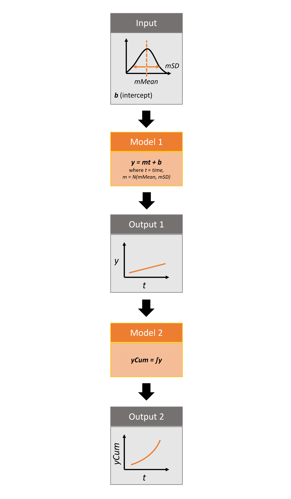

# rsyncrosim: introduction to pipelines

This vignette will cover how to implement model pipelines using the
`rsyncrosim` package within the [SyncroSim](https://syncrosim.com/)
software framework. For an overview of
[SyncroSim](https://syncrosim.com/) and
[`rsyncrosim`](https://cran.r-project.org/web/packages/rsyncrosim/index.html),
as well as a basic usage tutorial for `rsyncrosim`, see the
[Introduction to
`rsyncrosim`](https://syncrosim.github.io/rsyncrosim/articles/a01_rsyncrosim_vignette_basic.html)
vignette. To learn how to use iterations in the `rsyncrosim` interface,
see the [`rsyncrosim`: introduction to
uncertainty](https://syncrosim.github.io/rsyncrosim/articles/a02_rsyncrosim_vignette_uncertainty.html)
vignette.

## SyncroSim Package: `helloworldPipeline`

To demonstrate how to link models in a pipeline using the `rsyncrosim`
interface, we will need the
[helloworldPipeline](https://github.com/ApexRMS/helloworldPipeline)
SyncroSim package. `helloworldPipeline` was designed to be a simple
package to introduce pipelines to SyncroSim modeling workflows. Models
(i.e. transformers) connected by pipelines allow the user to implement
multiple transformers in a modeling workflow and access intermediate
outputs of a transformer without having to create multiple scenarios.

The package takes from the user 3 inputs, *mMean*, *mSD*, and *b*. For
each iteration, a value *m*, representing the slope, is sampled from a
normal distribution with mean of *mMean* and standard deviation of
*mSD*. The *b* value represents the intercept. In the first model in the
pipeline, these input values are run through a linear model, *y=mt+b*,
where *t* is *time*, and the *y* value is returned as output. The second
model takes *y* as input and calculates the cumulative sum of *y* over
time, returning a new variable *yCum* as output.



Infographic of helloworldPipeline package

For more details on the different features of the `helloworldPipeline`
SyncroSim package, consult the SyncroSim [Enhancing a Package: Linking
Models](https://docs.syncrosim.com/how_to_guides/package_create_pipelines.html)
tutorial.

## Setup

### Install SyncroSim

Before using `rsyncrosim` you will first need to [download and
install](https://syncrosim.com/download/) the SyncroSim software.
Versions of SyncroSim exist for both Windows and Linux.

*Note*: this tutorial was developed using `rsyncrosim` version 2.0. To
use `rsyncrosim` version 2.0 or greater, SyncroSim version 3.0 or
greater is required.

### Installing and loading R packages

You will need to install the `rsyncrosim` R package, either using
[CRAN](https://cran.r-project.org/) or from the `rsyncrosim` [GitHub
repository](https://github.com/syncrosim/rsyncrosim/releases/). Versions
of `rsyncrosim` are available for both Windows and Linux.

In a new R script, load the `rsyncrosim` package.

``` r

# Load R package for working with SyncroSim
library(rsyncrosim)
```

### Connecting R to SyncroSim using `session()`

Finish setting up the R environment for the `rsyncrosim` workflow by
creating a SyncroSim Session object. Use the
[`session()`](https://syncrosim.github.io/rsyncrosim/reference/session.md)
function to connect R to your installed copy of the SyncroSim software.

``` r

mySession <- session("path/to/install_folder")      # Create a Session based SyncroSim install folder
mySession <- session()                              # Using default install folder (Windows only)
mySession                                           # Displays the Session object
```

    ## class               : Session
    ## filepath [character]: C:\PROGRA~1\SYNCRO~1
    ## silent [logical]    : TRUE
    ## printCmd [logical]  : FALSE
    ## condaFilepath [NULL]:

Use the
[`version()`](https://syncrosim.github.io/rsyncrosim/reference/version.md)
function to ensure you are using the latest version of SyncroSim.

``` r

version(mySession)
```

    ## [1] "3.1.20"

### Installing SyncroSim packages using `installPackage()`

Install `helloworldPipeline` using the `rynscrosim` function
[`installPackage()`](https://syncrosim.github.io/rsyncrosim/reference/installPackage.md).
This function takes a package name as input and then queries the
SyncroSim package server for the specified package.

``` r

# Install helloworldPipeline
installPackage("helloworldPipeline")
```

    ## Package <helloworldPipeline v2.1.0> installed

`helloworldPipeline` should now be included in the package list returned
by the
[`packages()`](https://syncrosim.github.io/rsyncrosim/reference/packages.md)
function in `rsyncrosim`:

``` r

# Get list of installed packages
packages()
```

    ##                 name version
    ## 1 helloworldPipeline   2.1.0
    ##                                                  description
    ## 1 Example demonstrating how to use pipelines with an R model
    ##                                                                                 location
    ## 1 C:\\Users\\HannahAdams\\AppData\\Local\\SyncroSim\\Packages\\helloworldPipeline\\2.1.0
    ##   status
    ## 1     OK

## Create a modeling workflow

When creating a new modeling workflow from scratch, we need to create
objects of the following scopes:

- [Library](https://docs.syncrosim.com/how_to_guides/library_overview.html)
- [Projects](https://docs.syncrosim.com/how_to_guides/library_overview.html)
- [Scenarios](https://docs.syncrosim.com/how_to_guides/library_overview.html)

For more information on these scopes, see the [Introduction to
`rsyncrosim`](https://syncrosim.github.io/rsyncrosim/rsyncrosim_vignette_basic.html)
vignette.

### Set up library, project, and scenario

``` r

# Create a new library
myLibrary <- ssimLibrary(name = "helloworldLibrary.ssim",
                         session = mySession,
                         packages = "helloworldPipeline",
                         overwrite = TRUE)
```

    ## Package <helloworldPipeline v2.1.0> added

``` r

# Open the default project
myProject = project(ssimObject = myLibrary, project = "Definitions")

# Create a new scenario (associated with the default project)
myScenario = scenario(ssimObject = myProject, scenario = "My first scenario")
```

### View model inputs using `datasheet()`

View the datasheets associated with your new scenario using the
[`datasheet()`](https://syncrosim.github.io/rsyncrosim/reference/datasheet.md)
function from `rsyncrosim`.

``` r

# View all datasheets associated with a library, project, or scenario
datasheet(myScenario)
```

    ##       scope                                     name             displayName
    ## 25 scenario                   core_DistributionValue           Distributions
    ## 26 scenario               core_ExternalVariableValue      External Variables
    ## 27 scenario                            core_Pipeline                Pipeline
    ## 28 scenario              core_SpatialMultiprocessing Spatial Multiprocessing
    ## 29 scenario        helloworldPipeline_InputDatasheet                  Inputs
    ## 30 scenario helloworldPipeline_IntermediateDatasheet    Intermediate Outputs
    ## 31 scenario       helloworldPipeline_OutputDatasheet                 Outputs
    ## 32 scenario            helloworldPipeline_RunControl             Run Control

From the list of datasheets above, we can see that there are four
datasheets specific to the `helloworldPipeline` package, including an
`Inputs` datasheet, an `Intermediate Outputs` datasheet, and an
`Outputs` datasheet. These three datasheets are connected by
transformers. The values from the `Inputs` datasheet are used as the
input for the first transformer, which *transforms* the input data to
output data through a series of model calculations. The output data from
the first transformer is contained within the `Intermediate Outputs`
datasheet. The values from the `Intermediate Outputs` datasheet are then
used as input for the second transformer. The output from the second
transformer is stored in the `Outputs` datasheet.

### Configure model inputs using `datasheet()` and `addRow()`

Currently our input scenario datasheets are empty! We need to add some
values to our `Inputs` datasheet (`InputDatasheet`) and Run Control
datasheet (`RunControl`) so we can run our model. We also need to add
some information to the core `Pipeline` datasheet to specify which
transformers are run in which order.

**Inputs Datasheet**

First, assign the contents of the `Inputs` datasheet to a new data frame
variable using
[`datasheet()`](https://syncrosim.github.io/rsyncrosim/reference/datasheet.md),
then check the columns that need input values.

``` r

# Load Inputs datasheet to a new R data frame
myInputDataframe <- datasheet(myScenario,
                              name = "helloworldPipeline_InputDatasheet")

# Check the columns of the input data frame
str(myInputDataframe)
```

    ## 'data.frame':    0 obs. of  3 variables:
    ##  $ mMean: num 
    ##  $ mSD  : num 
    ##  $ b    : num

The `Inputs` datasheet requires three values:

- `mMean` : the mean of the slope normal distribution.
- `mSD` : the standard deviation of the slope normal distribution.
- `b` : the intercept of the linear equation.

Add these values to a new data frame, then use the
[`addRow()`](https://syncrosim.github.io/rsyncrosim/reference/addRow.md)
function from `rsyncrosim` to update the input data frame

``` r

# Create input data and add it to the input data frame
myInputRow <- data.frame(mMean = 2, mSD = 4, b = 3)
myInputDataframe <- addRow(myInputDataframe, myInputRow)

# Check values
myInputDataframe
```

    ##   mMean mSD b
    ## 1     2   4 3

Finally, save the updated R data frame to a SyncroSim datasheet using
[`saveDatasheet()`](https://syncrosim.github.io/rsyncrosim/reference/saveDatasheet.md).

``` r

# Save input R data frame to a SyncroSim datasheet
saveDatasheet(ssimObject = myScenario, 
              data = myInputDataframe,
              name = "helloworldPipeline_InputDatasheet")
```

    ## Datasheet <helloworldPipeline_InputDatasheet> saved

**Run Control Datasheet**

The `Run Control` datasheet provides information about how many time
steps and iterations to use in the model. Here, we set the number of
iterations, as well as the minimum and maximum time steps for our model.
Let’s take a look at the columns that need input values.

``` r

# Load Run Control datasheet to a new R data frame
runSettings <- datasheet(myScenario, name = "helloworldPipeline_RunControl")

# Check the columns of the Run Control data frame
str(runSettings)
```

    ## 'data.frame':    0 obs. of  3 variables:
    ##  $ MinimumTimestep : num 
    ##  $ MaximumTimestep : num 
    ##  $ MaximumIteration: num

The Run Control datasheet requires the following 3 columns:

- `MaximumIteration` : total number of iterations to run the model for.
- `MinimumTimestep` : the starting time point of the simulation.
- `MaximumTimestep` : the end time point of the simulation.

*Note:* A fourth hidden column, `MinimumIteration`, also exists in the
Run Control datasheet (default=1).

We’ll add this information to a new data frame and then add it to the
Run Control data frame using
[`addRow()`](https://syncrosim.github.io/rsyncrosim/reference/addRow.md).

``` r

# Create Run Control data and add it to the Run Control data frame
runSettingsRow <- data.frame(MaximumIteration = 5,
                             MinimumTimestep = 1,
                             MaximumTimestep = 10)
runSettings <- addRow(runSettings, runSettingsRow)

# Check values
runSettings
```

    ##   MinimumTimestep MaximumTimestep MaximumIteration
    ## 1               1              10                5

Finally, save the R data frame to a SyncroSim datasheet using
[`saveDatasheet()`](https://syncrosim.github.io/rsyncrosim/reference/saveDatasheet.md).

``` r

# Save Run Control R data frame to a SyncroSim datasheet
saveDatasheet(ssimObject = myScenario, data = runSettings,
              name = "helloworldPipeline_RunControl")
```

    ## Datasheet <helloworldPipeline_RunControl> saved

**Pipeline Datasheet**

To implement pipelines in our package, we need to specify the order in
which to run the transformers in our pipeline by adding data to the
`Pipeline` datasheet. The `Pipeline` datasheet is a built-in SyncroSim
datasheet, meaning that it comes with every SyncroSim library regardless
of which packages that library uses. We access it using the “core\_”
prefix with the
[`datasheet()`](https://syncrosim.github.io/rsyncrosim/reference/datasheet.md)
function.

From viewing the structure of the `Pipeline` datasheet we know that the
`StageNameId` is a factor with two levels:

- Hello World Pipeline 1 (R)
- Hello World Pipeline 2 (R)

We will set the data for this datasheet such that
`Hello World Pipeline 1 (R)` is run first, then
`Hello World Pipeline 2 (R)`. This way, the output from
`Hello World Pipeline 1 (R)` is used as the input for
`Hello World Pipeline 2 (R)`.

``` r

# Load Pipeline datasheet to a new R data frame
myPipelineDataframe <- datasheet(myScenario, name = "core_Pipeline")

# Check the columns of the Pipeline data frame
str(myPipelineDataframe)
```

    ## 'data.frame':    0 obs. of  2 variables:
    ##  $ StageNameId: Factor w/ 2 levels "Hello World Pipeline 1 (R)",..: 
    ##  $ RunOrder   : num

``` r

# Create Pipeline data and add it to the Pipeline data frame
myPipelineRow <- data.frame(StageNameId = c("Hello World Pipeline 1 (R)", 
                                            "Hello World Pipeline 2 (R)"),
                            RunOrder = c(1, 2))

myPipelineDataframe <- addRow(myPipelineDataframe, myPipelineRow)

# Check values
myPipelineDataframe
```

    ##                  StageNameId RunOrder
    ## 1 Hello World Pipeline 1 (R)        1
    ## 2 Hello World Pipeline 2 (R)        2

``` r

# Save Pipeline R data frame to a SyncroSim datasheet
saveDatasheet(ssimObject = myScenario, data = myPipelineDataframe,
              name = "core_Pipeline")
```

    ## Datasheet <core_Pipeline> saved

## Run Scenarios

### Setting the number of multiprocessing jobs

If we have a large model and we want to parallelize the run using
multiprocessing, we can modify the library-scoped “core_Multiprocessing”
datasheet. Since we are using five iterations in our model, we will set
the number of jobs to five so each multiprocessing core will run a
single iteration.

``` r

# Load list of available library-scoped datasheets
datasheet(myLibrary)
```

    ##      scope                              name                    displayName
    ## 1  library                       core_Backup                         Backup
    ## 2  library                     core_JlConfig                          Julia
    ## 3  library              core_Multiprocessing                Multiprocessing
    ## 4  library                       core_Option                        Options
    ## 5  library         core_ProcessorGroupOption        Processor Group Options
    ## 6  library          core_ProcessorGroupValue         Processor Group Values
    ## 7  library                     core_PyConfig                         Python
    ## 8  library                      core_RConfig                              R
    ## 9  library                      core_Setting                       Settings
    ## 10 library core_SpatialMultiprocessingOption Spatial Multiprocessing Option
    ## 11 library                core_SpatialOption                Spatial Options
    ## 12 library                    core_SysFolder                        Folders
    ## 13 library                  core_Terminology                    Terminology

``` r

# Load the library-scoped multiprocessing datasheet
multiprocess <- datasheet(myLibrary, name = "core_Multiprocessing")
```

    ## [1] "Note: MaximumJobs should be between 1 and 9999"

``` r

# Check required inputs
str(multiprocess)
```

    ## 'data.frame':    1 obs. of  4 variables:
    ##  $ EnableMultiprocessing  : logi FALSE
    ##  $ MaximumJobs            : num 15
    ##  $ EnableMultiScenario    : logi FALSE
    ##  $ EnableCopyExternalFiles: logi NA

``` r

# Enable multiprocessing
multiprocess$EnableMultiprocessing <- TRUE

# Set maximum number of jobs to 5
multiprocess$MaximumJobs <- 4

# Save multiprocessing configuration
saveDatasheet(ssimObject = myLibrary, 
              data = multiprocess, 
              name = "core_Multiprocessing")
```

    ## Datasheet <core_Multiprocessing> saved

### Setting run parameters with `run()`

Now, when we run our scenario, it will use the desired multiprocessing
configuration.

``` r

# Run the first scenario we created
myResultScenario <- run(myScenario)
```

    ## [1] "Running scenario [1] My first scenario"

    ## This model uses Conda environments, but no Conda installation was found. Using local environment.

Once the run is complete, we can compare the original scenario to the
result scenario to see which datasheets have been modified. Using the
[`datasheet()`](https://syncrosim.github.io/rsyncrosim/reference/datasheet.md)
function with the `optional` argument set to `TRUE`, we see that data
has been added to both the `Intermediate Outputs` and `Outputs`
datasheets after running the scenario (see `data` column below).

``` r

# Datasheets for original scenario
datasheet(myScenario, optional = TRUE)
```

    ##       scope            package                                     name
    ## 5  scenario               core                   core_DistributionValue
    ## 7  scenario               core               core_ExternalVariableValue
    ## 15 scenario               core                            core_Pipeline
    ## 21 scenario               core              core_SpatialMultiprocessing
    ## 29 scenario helloworldPipeline        helloworldPipeline_InputDatasheet
    ## 30 scenario helloworldPipeline helloworldPipeline_IntermediateDatasheet
    ## 31 scenario helloworldPipeline       helloworldPipeline_OutputDatasheet
    ## 32 scenario helloworldPipeline            helloworldPipeline_RunControl
    ##                displayName isSingle displayMember  data scenario
    ## 5            Distributions    FALSE           N/A FALSE        1
    ## 7       External Variables    FALSE           N/A FALSE        1
    ## 15                Pipeline    FALSE           N/A  TRUE        1
    ## 21 Spatial Multiprocessing     TRUE           N/A FALSE        1
    ## 29                  Inputs     TRUE           N/A  TRUE        1
    ## 30    Intermediate Outputs    FALSE           N/A FALSE        1
    ## 31                 Outputs    FALSE           N/A FALSE        1
    ## 32             Run Control     TRUE           N/A  TRUE        1

``` r

# Datasheets for result scenario
datasheet(myResultScenario, optional = TRUE)
```

    ##       scope            package                                     name
    ## 5  scenario               core                   core_DistributionValue
    ## 7  scenario               core               core_ExternalVariableValue
    ## 15 scenario               core                            core_Pipeline
    ## 21 scenario               core              core_SpatialMultiprocessing
    ## 29 scenario helloworldPipeline        helloworldPipeline_InputDatasheet
    ## 30 scenario helloworldPipeline helloworldPipeline_IntermediateDatasheet
    ## 31 scenario helloworldPipeline       helloworldPipeline_OutputDatasheet
    ## 32 scenario helloworldPipeline            helloworldPipeline_RunControl
    ##                displayName isSingle displayMember  data scenario
    ## 5            Distributions    FALSE           N/A FALSE        1
    ## 7       External Variables    FALSE           N/A FALSE        1
    ## 15                Pipeline    FALSE           N/A  TRUE        1
    ## 21 Spatial Multiprocessing     TRUE           N/A FALSE        1
    ## 29                  Inputs     TRUE           N/A  TRUE        1
    ## 30    Intermediate Outputs    FALSE           N/A FALSE        1
    ## 31                 Outputs    FALSE           N/A FALSE        1
    ## 32             Run Control     TRUE           N/A  TRUE        1

## View results

The next step is to view the output datasheets added to the result
scenario when it was run.

### Viewing intermediate results with `datasheet()`

First, we will view the `Intermediate Outputs` datasheet from the result
scenario. We can load the result tables using the
[`datasheet()`](https://syncrosim.github.io/rsyncrosim/reference/datasheet.md)
function. The `Intermediate Outputs` datasheet corresponds to the
results from the `Hello World Pipeline 1` transformer stage.

``` r

# Results of first scenario
resultsSummary <- datasheet(myResultScenario,
                            name = "helloworldPipeline_IntermediateDatasheet")

# View results table
head(resultsSummary)
```

    ## [1] y
    ## <0 rows> (or 0-length row.names)

We can see that for every timestep in an iteration we have a new value
of *y* corresponding to *y=mt+b*.

### Viewing final results with `datasheet()`

Now, we will view the final output datasheet from the result scenario.
Again, we will use
[`datasheet()`](https://syncrosim.github.io/rsyncrosim/reference/datasheet.md)
to load the result table. The `Outputs` datasheet corresponds to the
results from the `Hello World Pipeline 2` transformer stage.

``` r

# Results of first scenario
resultsSummary <- datasheet(myResultScenario,
                            name = "helloworldPipeline_OutputDatasheet")

# View results table
head(resultsSummary)
```

    ## [1] yCum
    ## <0 rows> (or 0-length row.names)

We can see for each timestep in an iteration, we have a new value of
*yCum*, representing the cumulative value of *y* over time.
