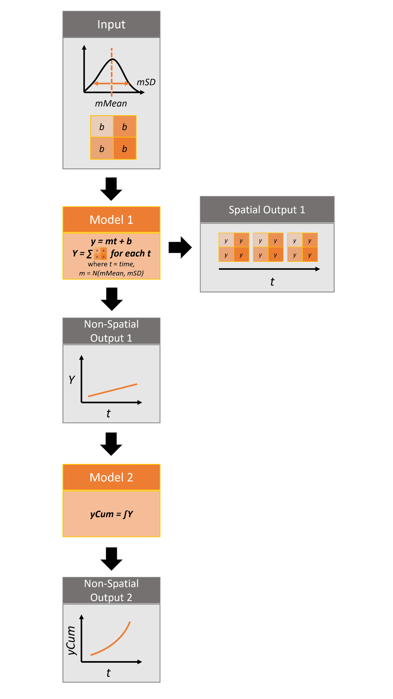
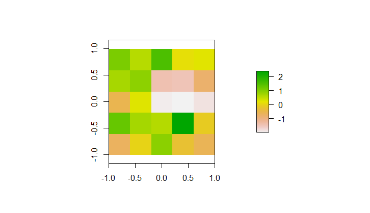

# rsyncrosim: introduction to spatial data

This vignette will cover incorporating spatial data into SyncroSim
models using the `rsyncrosim` package within the
[SyncroSim](https://syncrosim.com/) software framework. For an overview
of [SyncroSim](https://syncrosim.com/) and
[`rsyncrosim`](https://cran.r-project.org/web/packages/rsyncrosim/index.html),
as well as a basic usage tutorial for `rsyncrosim`, see the
[Introduction to
`rsyncrosim`](https://syncrosim.github.io/rsyncrosim/articles/a01_rsyncrosim_vignette_basic.html)
vignette. To learn how to use iterations in the `rsyncrosim` interface,
see the [`rsyncrosim`: introduction to
uncertainty](https://syncrosim.github.io/rsyncrosim/articles/a02_rsyncrosim_vignette_uncertainty.html)
vignette. To learn how to link models using pipelines in the
`rsyncrosim` interface, see the [`rsyncrosim`: introduction to
pipelines](https://syncrosim.github.io/rsyncrosim/articles/a03_rsyncrosim_vignette_pipelines.html)
vignette.

## SyncroSim Package: helloworldSpatial

To demonstrate how to use spatial data in the `rsyncrosim` interface, we
will be using the
[helloworldSpatial](https://github.com/ApexRMS/helloworldSpatial)
SyncroSim package. `helloworldSpatial` was designed to be a simple
package to show off some key functionalities of SyncroSim, including the
ability to use both spatial and non-spatial data.

The package takes 3 inputs, *mMean*, *mSD*, and a spatial raster file of
intercept (*b*) values. For each iteration, a value *m*, representing
the slope, is sampled from a normal distribution with mean of *mMean*
and standard deviation of *mSD*. These values are run through 2 models
to produce both spatial and non-spatial outputs.



Infographic of helloworldSpatial package

For more details on the different features of the `helloworldSpatial`
SyncroSim package, consult the SyncroSim [Enhancing a Package:
Integrating Spatial
Data](https://docs.syncrosim.com/how_to_guides/package_create_spatial.html)
tutorial.

## Setup

### Install SyncroSim

Before using `rsyncrosim` you will first need to [download and
install](https://syncrosim.com/download/) the SyncroSim software.
Versions of SyncroSim exist for both Windows and Linux.

*Note*: this tutorial was developed using `rsyncrosim` version 2.0. To
use `rsyncrosim` version 2.0 or greater, SyncroSim version 3.0 or
greater is required.

### Installing and loading R packages

You will need to install the `rsyncrosim` R package, either using
[CRAN](https://cran.r-project.org/) or from the `rsyncrosim` [GitHub
repository](https://github.com/syncrosim/rsyncrosim/releases/). Versions
of `rsyncrosim` are available for both Windows and Linux. You may need
to install the `terra` package from CRAN as well.

In a new R script, load the necessary packages. This includes the
`rsyncrosim` and `terra` R packages.

``` r

# Load R packages
library(rsyncrosim)  # package for working with SyncroSim
library(terra)       # package for working with spatial data
```

### Connecting R to SyncroSim using `session()`

Finish setting up the R environment for the `rsyncrosim` workflow by
creating a SyncroSim Session object. Use the
[`session()`](https://syncrosim.github.io/rsyncrosim/reference/session.md)
function to connect R to your installed copy of the SyncroSim software.

``` r

mySession <- session("path/to/install_folder")      # Create a Session based SyncroSim install folder
mySession <- session()                              # Using default install folder (Windows only)
mySession                                           # Displays the Session object
```

    ## class               : Session
    ## filepath [character]: C:\PROGRA~1\SYNCRO~3
    ## silent [logical]    : TRUE
    ## printCmd [logical]  : FALSE
    ## condaFilepath [NULL]:

Use the
[`version()`](https://syncrosim.github.io/rsyncrosim/reference/version.md)
function to ensure you are using the latest version of SyncroSim.

``` r

version(mySession)
```

    ## [1] "3.1.30"

### Installing SyncroSim packages using `installPackage()`

Install `helloworldSpatial` using the `rynscrosim` function
[`installPackage()`](https://syncrosim.github.io/rsyncrosim/reference/installPackage.md).
This function takes a package name as input and then queries the
SyncroSim package server for the specified package.

``` r

# Install helloworldSpatial
installPackage("helloworldSpatial")
```

    ## Package <helloworldSpatial v2.1.0> installed

`helloworldSpatial` should now be included in the package list returned
by the
[`packages()`](https://syncrosim.github.io/rsyncrosim/reference/packages.md)
function in `rsyncrosim`:

``` r

# Get list of installed packages
packages()
```

    ##                name version
    ## 1 helloworldSpatial   2.1.0
    ##                                                     description
    ## 1 Example demonstrating how to use spatial data with an R model
    ##                                                                                location
    ## 1 C:\\Users\\HannahAdams\\AppData\\Local\\SyncroSim\\Packages\\helloworldSpatial\\2.1.0
    ##   status
    ## 1     OK

## Create a modeling workflow

When creating a new modeling workflow from scratch, we need to create
objects of the following scopes:

- [Library](https://docs.syncrosim.com/how_to_guides/library_overview.html)
- [Projects](https://docs.syncrosim.com/how_to_guides/library_overview.html)
- [Scenarios](https://docs.syncrosim.com/how_to_guides/library_overview.html)

For more information on these scopes, see the [Introduction to
`rsyncrosim`](https://syncrosim.github.io/rsyncrosim/rsyncrosim_vignette_basic.html)
vignette.

### Set up library, project, and scenario

``` r

# Create a new library
myLibrary <- ssimLibrary(name = "helloworldLibrary.ssim",
                         session = mySession,
                         packages = "helloworldSpatial",
                         overwrite = TRUE)
```

    ## Package <helloworldSpatial v2.1.0> added

``` r

# Open the default project
myProject = rsyncrosim::project(ssimObject = myLibrary, project = "Definitions")

# Create a new scenario (associated with the default project)
myScenario = scenario(ssimObject = myProject, scenario = "My spatial scenario")
```

### View model inputs using `datasheet()`

View the datasheets associated with your new scenario using the
[`datasheet()`](https://syncrosim.github.io/rsyncrosim/reference/datasheet.md)
function from `rsyncrosim`.

``` r

# View all datasheets associated with a library, project, or scenario
datasheet(myScenario)
```

    ##       scope                                    name             displayName
    ## 26 scenario                  core_DistributionValue           Distributions
    ## 27 scenario              core_ExternalVariableValue      External Variables
    ## 28 scenario                           core_Pipeline                Pipeline
    ## 29 scenario             core_SpatialMultiprocessing Spatial Multiprocessing
    ## 30 scenario        helloworldSpatial_InputDatasheet                  Inputs
    ## 31 scenario helloworldSpatial_IntermediateDatasheet    Intermediate Outputs
    ## 32 scenario       helloworldSpatial_OutputDatasheet                 Outputs
    ## 33 scenario            helloworldSpatial_RunControl             Run Control

From the list of datasheets above, we can see that there are four
datasheets specific to the `helloworldSpatial` package, including an
`Inputs` datasheet, an `Intermediate Outputs` datasheet, an `Outputs`
datasheet, and a `Run Control` datasheet.

### Configure model inputs using `datasheet()` and `addRow()`

Currently our input scenario datasheets are empty! We need to add some
values to our `Inputs` datasheet, `Run Control` datasheet, and
`Pipeline` datasheet so we can run our model.

**Inputs datasheet**

First, assign the contents of the `Inputs` datasheet to a new data frame
variable using
[`datasheet()`](https://syncrosim.github.io/rsyncrosim/reference/datasheet.md),
then check the columns that need input values.

``` r

# Load Inputs datasheet to a new R data frame
myInputDataframe <- datasheet(myScenario,
                              name = "helloworldSpatial_InputDatasheet")

# Check the columns of the input data frame
str(myInputDataframe)
```

    ## 'data.frame':    0 obs. of  3 variables:
    ##  $ mMean              : num 
    ##  $ mSD                : num 
    ##  $ InterceptRasterFile: chr

The `Inputs` datasheet requires three values:

- `mMean` : the mean of a normal distribution that will determine the
  slope of the linear equation.
- `mSD` : the standard deviation of a normal distribution that will
  determine the slope of the linear equation.
- `InterceptRasterFile` : the file path to a *raster image*, in which
  each cell of the image will be an intercept in the linear equation.

In this example, the external file we are using for the
`InterceptRasterFile` is a simple 5x5 raster TIF file generated using
the `raster` package in R. The file used in this vignette can be found
[here](https://github.com/ApexRMS/helloworldSpatial/blob/main/images/input-raster.tif).



InterceptRasterFile input image

Add these values to a new data frame, then use the
[`addRow()`](https://syncrosim.github.io/rsyncrosim/reference/addRow.md)
function from `rsyncrosim` to update the input data frame

``` r

# Create input data and add it to the input data frame
myInputRow <- data.frame(mMean = 0, 
                         mSD = 4,
                         InterceptRasterFile = "path/to/input-raster.tif")
myInputDataframe <- addRow(myInputDataframe, myInputRow)

# Check values
myInputDataframe
```

    ##   mMean mSD      InterceptRasterFile
    ## 1     0   4 path/to/input-raster.tif

Finally, save the updated R data frame to a SyncroSim datasheet using
[`saveDatasheet()`](https://syncrosim.github.io/rsyncrosim/reference/saveDatasheet.md).

``` r

# Save input R data frame as a SyncroSim datasheet
saveDatasheet(ssimObject = myScenario, 
              data = myInputDataframe,
              name = "helloworldSpatial_InputDatasheet")
```

    ## Datasheet <helloworldSpatial_InputDatasheet> saved

**Run Control datasheet**

The `Run Control` datasheet sets the number of iterations and the
minimum and maximum time steps for our model. We’ll assign the contents
of this datasheet to a new data frame variable as well and then add then
update the information in the data frame using
[`addRow()`](https://syncrosim.github.io/rsyncrosim/reference/addRow.md).
We need to specify data for the following four columns:

- `MaximumIteration` : total number of iterations to run the model for.
- `MinimumTimestep` : the starting time point of the simulation.
- `MaximumTimestep` : the end time point of the simulation.

*Note:* A fourth hidden column, `MinimumIteration`, also exists in the
`Run Control` datasheet (default=1).

``` r

# Load Run Control datasheet to an R data frame
runSettings <- datasheet(myScenario, name = "helloworldSpatial_RunControl")

# Check the columns of the Run Control data frame
str(runSettings)
```

    ## 'data.frame':    0 obs. of  3 variables:
    ##  $ MinimumTimestep : num 
    ##  $ MaximumTimestep : num 
    ##  $ MaximumIteration: num

``` r

# Create Run Control data and add it to the Run Control data frame
runSettingsRow <- data.frame(MaximumIteration = 5,
                             MinimumTimestep = 1,
                             MaximumTimestep = 10)

runSettings <- addRow(runSettings, runSettingsRow)

# Check values
runSettings
```

    ##   MinimumTimestep MaximumTimestep MaximumIteration
    ## 1               1              10                5

``` r

# Save Run Control R data frame to a SyncroSim datasheet
saveDatasheet(ssimObject = myScenario, 
              data = runSettings,
              name = "helloworldSpatial_RunControl")
```

    ## Datasheet <helloworldSpatial_RunControl> saved

**Pipeline datasheet**

The `helloworldSpatial` package uses pipelines to link the output of one
model to the input of a second model. To learn more about pipelines, see
the [`rsyncrosim`: introduction to
pipelines](https://syncrosim.github.io/rsyncrosim/rsyncrosim_vignette_pipelines.html)
vignette and the SyncroSim [Enhancing a Package: Linking
Models](https://docs.syncrosim.com/how_to_guides/package_create_pipelines.html)
tutorial.

To implement pipelines in our package, we need to specify the order in
which to run the transformers (i.e. models) in our pipeline by editing
the `Pipeline` datasheet. The `Pipeline` datasheet is part of the
built-in SyncroSim core, so we access it using the “core\_” prefix with
the
[`datasheet()`](https://syncrosim.github.io/rsyncrosim/reference/datasheet.md)
function.

From viewing the structure of the `Pipeline` datasheet we know that the
`StageNameId` is a factor with two levels:

- Hello World Spatial 1 (R)
- Hello World Spatial 2 (R)

We will set the data for this datasheet such that
`Hello World Spatial 1 (R)` is run first, then
`Hello World Spatial 2 (R)`. This way, the output from
`Hello World Spatial 1 (R)` is used as the input for
`Hello World Spatial 2 (R)`.

``` r

# Load Pipeline datasheet to an R data frame
myPipelineDataframe <- datasheet(myScenario, name = "core_Pipeline")

# Check the columns of the Pipeline data frame
str(myPipelineDataframe)
```

    ## 'data.frame':    0 obs. of  2 variables:
    ##  $ StageNameId: Factor w/ 2 levels "Hello World Spatial 1 (R)",..: 
    ##  $ RunOrder   : num

``` r

# Create Pipeline data and add it to the Pipeline data frame
myPipelineRow <- data.frame(StageNameId = c("Hello World Spatial 1 (R)", 
                                            "Hello World Spatial 2 (R)"),
                            RunOrder = c(1, 2))

myPipelineDataframe <- addRow(myPipelineDataframe, myPipelineRow)

# Check values
myPipelineDataframe
```

    ##                 StageNameId RunOrder
    ## 1 Hello World Spatial 1 (R)        1
    ## 2 Hello World Spatial 2 (R)        2

``` r

# Save Pipeline R data frame to a SyncroSim datasheet
saveDatasheet(ssimObject = myScenario, data = myPipelineDataframe,
              name = "core_Pipeline")
```

    ## Datasheet <core_Pipeline> saved

## Run scenarios

### Setting the number of multiprocessing jobs

If we have a large model and we want to parallelize the run using
multiprocessing, we can modify the library-scoped “core_Multiprocessing”
datasheet. Since we are using five iterations in our model, we will set
the number of jobs to five so each multiprocessing core will run a
single iteration.

``` r

# Load list of available library-scoped datasheets
datasheet(myLibrary)
```

    ##      scope                              name                    displayName
    ## 1  library                       core_Backup                         Backup
    ## 2  library                     core_JlConfig                          Julia
    ## 3  library              core_Multiprocessing                Multiprocessing
    ## 4  library                       core_Option                        Options
    ## 5  library         core_ProcessorGroupOption        Processor Group Options
    ## 6  library          core_ProcessorGroupValue         Processor Group Values
    ## 7  library             core_PublishDatasheet               PublishDatasheet
    ## 8  library                     core_PyConfig                         Python
    ## 9  library                      core_RConfig                              R
    ## 10 library                      core_Setting                       Settings
    ## 11 library core_SpatialMultiprocessingOption Spatial Multiprocessing Option
    ## 12 library                core_SpatialOption                Spatial Options
    ## 13 library                    core_SysFolder                        Folders
    ## 14 library                  core_Terminology                    Terminology

``` r

# Load the library-scoped multiprocessing datasheet
multiprocess <- datasheet(myLibrary, name = "core_Multiprocessing")
```

    ## [1] "Note: MaximumJobs should be between 1 and 9999"

``` r

# Check required inputs
str(multiprocess)
```

    ## 'data.frame':    1 obs. of  4 variables:
    ##  $ EnableMultiprocessing  : logi FALSE
    ##  $ MaximumJobs            : num 15
    ##  $ EnableMultiScenario    : logi FALSE
    ##  $ EnableCopyExternalFiles: logi NA

``` r

# Enable multiprocessing
multiprocess$EnableMultiprocessing <- TRUE

# Set maximum number of jobs to 5
multiprocess$MaximumJobs <- 4

# Save multiprocessing configuration
saveDatasheet(ssimObject = myLibrary, 
              data = multiprocess, 
              name = "core_Multiprocessing")
```

    ## Datasheet <core_Multiprocessing> saved

### Setting run parameters with `run()`

Now, when we run our scenario, it will use the desired multiprocessing
configuration.

``` r

# Run the first scenario we created
myResultScenario <- run(myScenario)
```

    ## [1] "Running scenario [1] My spatial scenario"

    ## This model uses Conda environments, but no Conda installation was found. Using local environment.

After the scenario has been run, a results scenario is created that
contains results in the output datasheets.

## View results

The next step is to view the output datasheets added to the result
scenario when it was run.

### Viewing non-spatial results with `datasheet()`

First, we will view the non-spatial results within the results
scenarios. For each step in the pipeline, We can load the result tables
using the
[`datasheet()`](https://syncrosim.github.io/rsyncrosim/reference/datasheet.md)
function.

``` r

# Load results of first transformer in the pipeline
resultsSummary <- datasheet(myResultScenario,
                            name = "helloworldSpatial_IntermediateDatasheet")

# View results table of first transformer in the pipeline
head(resultsSummary)
```

    ##   Iteration Timestep          y        OutputRasterFile
    ## 1         1        1  -178.7381 rasterMap_iter1_ts1.tif
    ## 2         1        2  -353.1423 rasterMap_iter1_ts2.tif
    ## 3         1        3  -527.5464 rasterMap_iter1_ts3.tif
    ## 4         1        4  -701.9505 rasterMap_iter1_ts4.tif
    ## 5         1        5  -876.3547 rasterMap_iter1_ts5.tif
    ## 6         1        6 -1050.7588 rasterMap_iter1_ts6.tif

``` r

# Load results of second transformer in the pipeline
resultsSummary2 <- datasheet(myResultScenario,
                             name = "helloworldSpatial_OutputDatasheet")

# View results table of second transformer in the pipeline
head(resultsSummary2)
```

    ##   Iteration Timestep       yCum
    ## 1         1        1  -178.7381
    ## 2         1        2  -531.8804
    ## 3         1        3 -1059.4268
    ## 4         1        4 -1761.3774
    ## 5         1        5 -2637.7320
    ## 6         1        6 -3688.4909

From viewing these datasheets, we can see that the spatial output is
contained within the `IntermediateDatasheet`, in the column called
`OutputRasterFile`.

### Viewing spatial results with `datasheetSpatRaster()`

For spatial results, we want to load the results as raster images. To do
this, we will use the
[`datasheetSpatRaster()`](https://syncrosim.github.io/rsyncrosim/reference/datasheetSpatRaster.md)
function from `rsyncrosim`. The first argument is the *result scenario*
object. Next, we specify the name of the datasheet containing raster
images using the `datasheet` argument, and the column pertaining to the
raster images using the `column` argument. The results contain many
raster images, since we have a raster for each combination of iteration
and timestep. We can use the `iteration` and `timestep` arguments to
specify a single raster image or a subset of raster images we want to
view.

``` r

# Load raster files for first result scenario with timestep and iteration
rasterMaps <- datasheetSpatRaster(
  myResultScenario,
  datasheet = "helloworldSpatial_IntermediateDatasheet",
  column = "OutputRasterFile",
  iteration = 1,
  timestep = 5
  )

# View results
rasterMaps
```

    ## class       : SpatRaster 
    ## size        : 5, 5, 1  (nrow, ncol, nlyr)
    ## resolution  : 0.4, 0.4  (x, y)
    ## extent      : -1, 1, -1, 1  (xmin, xmax, ymin, ymax)
    ## coord. ref. : lon/lat WGS 84 (EPSG:4326) 
    ## source      : rasterMap_iter1_ts5.tif 
    ## name        : rasterMap_iter1_ts5 
    ## min value   :           -37.50665 
    ## max value   :           -32.76239

``` r

plot(rasterMaps[[1]])
```


### Viewing spatial results in SyncroSim Studio

To create maps using the results scenario we just generated, open the
current library in SyncroSim Studio and sync the updates from
`rsyncrosim` using the “refresh” button in the upper toolbar (circled in
red below). All the updates made in `rsyncrosim` should appear in
SyncroSim Studio. We can now add the results scenario to the Results
Viewer and create our maps. For more information on generating map in
SyncroSim Studio, see the SyncroSim tutorials on
[creating](http://docs.syncrosim.com/how_to_guides/results_map_create.md)
and
[customizing](http://docs.syncrosim.com/how_to_guides/results_map_customize.md)
maps


Using `rsyncrosim` with SyncroSim Studio to map spatial data
