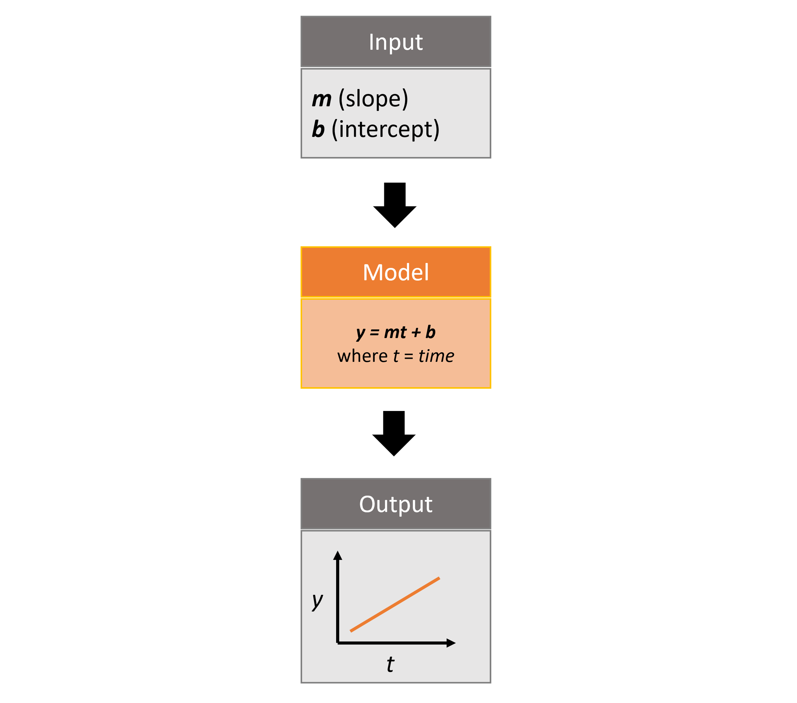

This vignette will cover the basics of using the `rsyncrosim` package within the <a href="https://syncrosim.com/" target="_blank">SyncroSim</a> software framework.


## Overview of SyncroSim


<a href="https://syncrosim.com/" target="_blank">SyncroSim</a> is a software platform that helps you turn your *data* into *forecasts*. At the core of SyncroSim is an engine that automatically structures your existing data, regardless of its original format. SyncroSim transforms this structured data into forecasts by running it through a Pipeline of calculations (i.e. a suite of *models*). Finally, SyncroSim  provides a rich interface to interact with your data and models, allowing you to explore and track the consequences of alternative "what-if" forecasting scenarios. Within this software framework is the ability to use and create <a href="https://docs.syncrosim.com/how_to_guides/package_overview.html" target="_blank">SyncroSim packages</a>.  

For more details consult the SyncroSim <a href="https://docs.syncrosim.com/" target="_blank">online documentation</a>.


## Overview of rsyncrosim


`rsyncrosim` is an R package designed to facilitate the development of modeling workflows for the <a href="https://syncrosim.com/" target="_blank">SyncroSim</a> software framework. Using the `rsyncrosim` interface, simulation models can be added and run through SyncroSim to transform scenario-based datasets into model forecasts. This R package takes advantage of general features of SyncroSim, such as defining Scenarios with spatial or non-spatial inputs, running Monte Carlo simulations, and summarizing model outputs. `rsyncrosim` requires SyncroSim 2.2.13 or higher.

For more details consult the `rsyncrosim` <a href="https://cran.r-project.org/web/packages/rsyncrosim/index.html" target="_blank">CRAN documentation</a>.

## SyncroSim Package: `helloworldTime`


To demonstrate the utility of the `rsyncrosim` interface, we will be using the <a href="https://github.com/ApexRMS/helloworldTime" target="_blank">helloworldTime</a> SyncroSim package. `helloworldTime` was designed to be a simple package to introduce timesteps to SyncroSim modeling workflows.

The package takes from the user 2 inputs, *m* and *b*, representing a slope and an intercept value. It then runs these input values through a linear model, *y=mt+b*, where *t* is *time*, and returns the *y* value as output.


{width=600px}

For more details on the different features of the `helloworldTime` SyncroSim package, consult the SyncroSim <a href="https://docs.syncrosim.com/how_to_guides/package_create_timesteps.html" target="_blank">Enhancing a Package: Adding Timesteps</a> tutorial.


## Setup


### Install SyncroSim

Before using `rsyncrosim` you will first need to <a href="https://syncrosim.com/download/" target="_blank">download and install</a> the SyncroSim software. Versions of SyncroSim exist for both Windows and Linux.

### Installing and loading R packages

You will need to install the `rsyncrosim` R package, either using <a href="https://cran.r-project.org/" target="_blank">CRAN</a> or from the `rsyncrosim` <a href="https://github.com/syncrosim/rsyncrosim/releases/" target="_blank">GitHub repository</a>. Versions of `rsyncrosim` are available for both Windows and Linux.

In a new R script, load the `rsyncrosim` package.

```{r load packages}
# Load R package for working with SyncroSim
library(rsyncrosim)
```

### Connecting R to SyncroSim using `session()`

The next step in setting up the R environment for the `rsyncrosim` workflow is to create a SyncroSim Session object in R that provides the connection to your installed copy of the SyncroSim software. A new Session is created using the `session()` function, in which the first argument is a path to the folder on your computer where SyncroSim has been installed. If the first argument is left blank, then the default install folder is used (Windows only).

```{r load session not run, warning = FALSE, eval = FALSE}
mySession <- session("path/to/install_folder")      # Create a Session based SyncroSim install folder
mySession <- session()                              # Using default install folder (Windows only)
mySession                                           # Displays the Session object
```

```{r load session run, warning = FALSE, echo = FALSE}
# Results of this code shown for above
mySession <- session()                              # Using default install folder (Windows only)
mySession                                           # Displays the Session object
```

You can check to see which version of SyncroSim your R script is connected to by running the `version()` function.

```{r check version, warning = FALSE}
version(mySession)
```

### Installing SyncroSim packages using `installPackage()`

Finally, check if the <a href="https://github.com/ApexRMS/helloworldTime" target="_blank">helloworldTime</a> package is already installed. Use the `package()` function from `rsyncrosim` to first get a list of all currently installed packages in SyncroSim.


```{r check packages 1, warning = FALSE, eval=FALSE}
# Get list of installed packages
packages()
```

```{r check packages 1 run, warning=FALSE, echo=FALSE}
installedPackages <- package()
no_pkg <- installedPackages[installedPackages$name == "noPackage", ]
no_pkg
```


Currently we do not have any packages installed! To see which packages are available from the SyncroSim package server, you can use the `installed = FALSE` argument in the `package()` function.

```{r check available packages}
availablePackages <- package(installed = FALSE)
head(availablePackages)
```

Install `helloworldTime` using the `rynscrosim` function `installPackage()`. This function takes a package name as input and then queries the SyncroSim package server for the specified package.

```{r remove package from server run, warning=FALSE, include=FALSE}
installedPackages <- package()
if (is.element(
  "helloworldTime", installedPackages$name)) uninstallPackage(
    "helloworldTime", force = TRUE)
```

```{r add package from server, warning = FALSE}
# Install helloworldTime
installPackage("helloworldTime")
```


To install the package from a `.ssimpkg` file on your local computer rather than installing directly from the server, you can use the `addPackage()` function with the file path to the `.ssimpkg`, rather than using the package name as the argument.

```{r add package from path not run, warning = FALSE, eval = FALSE}
# Install helloworldTime using file path to ssimpkg file
installPackage("path/to/helloworldTime.ssimpkg")
```

Now `helloworldTime` should be included in the package list:

```{r check packages 2, warning = FALSE, eval=FALSE}
# Get list of installed packages
package()
```

```{r check packages 2 run, warning=FALSE, echo=FALSE}
time_pkg <- installedPackages[installedPackages$name == "helloworldTime", ]
row.names(time_pkg) <- NULL
time_pkg
```


*Note:* you can also update installed packages using the `updatePackage()` function or delete installed packages using the `uninstallPackage()` function in `rsyncrosim`.


## Create a modeling workflow


When creating a new modeling workflow from scratch, we need to create objects of the following scopes:

* <a href="https://docs.syncrosim.com/how_to_guides/library_overview.html" target="_blank">Library</a>
* <a href="https://docs.syncrosim.com/how_to_guides/library_overview.html" target="_blank">Projects</a>
* <a href="https://docs.syncrosim.com/how_to_guides/library_overview.html" target="_blank">Scenarios</a>

These objects are hierarchical, such that a Library can contain many Projects, and each Project can contain many Scenarios. All parameters or configurations set in a Library are inherited by all Projects within the Library, and all parameters or configurations set in a Project are inherited by all Scenarios within that Project. See below for further information on these SyncroSim objects.

### Create a new library using `ssimLibrary()`

A SyncroSim <a href="https://docs.syncrosim.com/how_to_guides/library_overview.html" target="_blank">Library</a> is a file (with `.ssim` extension) that stores all of your model inputs and outputs. The format of each SyncroSim Library is unique to the SyncroSim Package with which it is associated. We use the `ssimLibrary()` function to create a new SsimLibrary object in R that is connected (through your Session) to a SyncroSim Library file.

```{r create Library, warning = FALSE, eval = FALSE, results = FALSE}
# Create a new Library
myLibrary <- ssimLibrary(name = "helloworldLibrary.ssim",
                         session = mySession,
                         package = "helloworldTime")

# Check Library information
myLibrary
```

```{r create Library output, warning = FALSE, echo = FALSE}
# Create a new Library
myLibrary <- ssimLibrary(name = "helloworldLibrary.ssim",
                         session = mySession,
                         package = "helloworldTime",
                         overwrite = TRUE)

# Create output
myLibraryOutput <- myLibrary
myLibraryOutput@filepath <- "path/to/helloworldLibrary.ssim"

# Print output
myLibraryOutput
```

We can also use the `ssimLibrary()` function to open an existing Library. For instance, now that we have created a Library called "helloworldLibrary.ssim", we would simply specify that we want to open this Library using the `name` argument.  

```{r}
# Open existing Library
myLibrary <- ssimLibrary(name = "helloworldLibrary.ssim")
```

Note that if you want to create a new Library file with an existing Library name rather than opening the existing Library, you can use `overwrite=TRUE` for the `ssimLibrary()` function.

### Open a project using `project()`

Each SyncroSim Library contains one or more SyncroSim <a href="https://docs.syncrosim.com/how_to_guides/library_overview.html" target="_blank">Projects</a>, each represented by a Project object in R. Projects typically store model inputs that are common to all your Scenarios. In most situations you will need only a single Project for your Library; by default each new Library starts with a single Project named "Definitions" (with a unique `projectId`= 1). The `project()` function is used to both create and retrieve Projects. Note that the `ssimObject` here can be the name of a Library or Scenario.

```{r open project, warning = FALSE, eval = FALSE, results = FALSE}
# Open existing Project
myProject = project(ssimObject = myLibrary, project = "Definitions")  # Using name for Project
myProject = project(ssimObject = myLibrary, project = 1)              # Using projectId for Project

# Check Project information
myProject
```

```{r open project output, warning = FALSE, echo = FALSE}
# Open existing Project
myProject = project(ssimObject = myLibrary, project = "Definitions")  # Using name for Project

# Create output
myProjectOutput <- myProject
myProjectOutput@filepath <- "path/to/helloworldLibrary.ssim"

# Print output
myProjectOutput
```


### Create a new scenario using `scenario()`

Finally, each SyncroSim Project contains one or more <a href="https://docs.syncrosim.com/how_to_guides/library_overview.html" target="_blank">Scenarios</a>, each represented by a Scenario object in R. 

Scenarios store the specific inputs and outputs associated with each Transformer in SyncroSim. SyncroSim models can be broken down into one or more of these Transformers. Each Transformer essentially runs a series of calculations on the input data to *transform* it into the output data. Scenarios can contain multiple Transformers connected by a series of Pipelines, such that the output of one Transformer becomes the input of the next. 

Each Scenario can be identified by its unique `scenarioId`. The `scenario()` function is used to both create and retrieve Scenarios. Note that the `ssimObject` here can be the name of a Library or a Project.

```{r create Scenario, warning = FALSE, eval = FALSE, results = FALSE}
# Create a new Scenario (associated with the default Project)
myScenario = scenario(ssimObject = myProject, scenario = "My first scenario")

# Check Scenario information
myScenario
```

```{r create Scenario output, warning = FALSE, echo = FALSE}
# Create a new Scenario (associated with the default Project)
myScenario = scenario(ssimObject = myProject, scenario = "My first scenario")

# Create output
myScenarioOutput <- myScenario
myScenarioOutput@filepath <- "path/to/helloworldLibrary.ssim"

# Print output
myScenarioOutput
```


### View model inputs using `datasheet()`
  
Each SyncroSim Library contains multiple SyncroSim <a href="https://docs.syncrosim.com/how_to_guides/properties_overview.html" target="_blank">Datasheets</a>. A SyncroSim Datasheet is simply a table of data stored in the Library, and they represent the input and output data for Transformers. Datasheets each have a *scope*: either <a href="https://docs.syncrosim.com/how_to_guides/library_overview.html" target="_blank">Library</a>, 
<a href="https://docs.syncrosim.com/how_to_guides/library_overview.html" target="_blank">Project</a>, or 
<a href="https://docs.syncrosim.com/how_to_guides/library_overview.html" target="_blank">Scenario</a>. Datasheets with a library scope represent data that is specified only once for the entire library, such as the location of the backup folder. Datasheets with a project scope represent data that are shared over all Scenarios within a project. Datasheets with a scenario scope represent data that must be specified for each generated scenario. We can view Datasheets of varying scopes using the `datasheet()` function from `rsyncrosim`.

```{r view datasheet list, warning = FALSE}
# View all Datasheets associated with a library, project, or scenario
datasheet(myScenario)
```

If we want to see more information about each Datasheet, such as the scope of the Datasheet or if it only accepts a single row of data, we can set the `optional` argument to `TRUE`.

```{r}
datasheet(myScenario, optional = TRUE)
```

From this output we can see the the `RunControl` Datasheet and `InputDatasheet` only accept a single row of data (i.e. `isSingle = TRUE`). This is something to consider when we configure our model inputs.

To view a specific Datasheet rather than just a data frame of available Datasheets, set the `name` parameter in the `datasheet()` function to the name of the Datasheet you want to view. The general syntax of the name is: "\<name of package\>_\<name of Datasheet\>". From the list of Datasheets above, we can see that there are 3 Datasheets specific to the `helloworldTime` package.

```{r view specific datasheet, warning = FALSE}
# View the input Datasheet for the Scenario
datasheet(myScenario, name = "helloworldTime_InputDatasheet")
```

Here, we are viewing the contents of a SyncroSim Datasheet as an R data frame. Although both SyncroSim Datasheets and R data frames are both represented as tables of data with predefined columns and an unlimited number of rows, the underlying structure of these tables differ.

### Configure model inputs using `datasheet()` and `addRow()`

Currently our input Scenario Datasheets are empty! We need to add some values to our input Datasheet (`InputDatasheet`) so we can run our model. First, assign the input Datasheet to a new data frame variable.

```{r assign input data, warning = FALSE}
# Assign contents of the input Datasheet to an R data frame
myInputDataframe <- datasheet(myScenario,
                              name = "helloworldTime_InputDatasheet")
```

Now, check the columns that need input values and the type of values these columns require (e.g. string, numeric, logical) using the `str()` base R function.

```{r check input data, warning = FALSE}
# Check the columns of the input data frame
str(myInputDataframe)
```

The input Datasheet requires 2 values:

* `m` : the slope of the linear equation.
* `b` : the intercept of the linear equation.

Now we will update the input data frame. This can be done in many ways (e.g. using the `dplyr` package), but `rsyncrosim` also provides a helper function called `addRow()` for easily adding new rows to R data frames. The `addRow()` function takes the `targetDataframe` as the first value (in this case, our input data frame that we want to update), and the data frame of new rows to append to the input data frame as the second value.

Note that in the previous section we discovered that the input Datasheets only accept a single row of values, so we can only have one value each for our slope (*m*) and intercept (*b*).

```{r add input data not run, warning = FALSE}
# Create input data and add it to the input data frame
myInputRow <- data.frame(m = 3, b = 10)
myInputDataframe <- addRow(myInputDataframe, myInputRow)

# Check values
myInputDataframe
```

### Saving modifications to datasheets using `saveDatasheet()`

Now that we have a complete data frame of input values, we will save this data frame to a SyncroSim Datasheet using the `saveDatasheet()` function. We can save our Datasheet at the Library, Project, or Scenario level, but in this case we will save it at the Scenario level.

```{r save input data, warning = FALSE}
# Save input R data frame to a SyncroSim Datasheet
saveDatasheet(ssimObject = myScenario, data = myInputDataframe,
              name = "helloworldTime_InputDatasheet")
```

### Configuring the `RunControl` datasheet

There is one other Datasheet that we need to configure for our package to run. The `RunControl` Datasheet provides information about how many time steps to use in the model. Here, we set the minimum and maximum time steps for our model. We'll add this information to an R data frame and then add it to the Run Control Datasheet using `addRow()`. We need to specify data for the following 2 columns:

* `MinimumTimestep` : the starting time point of the simulation.
* `MaximumTimestep` : the end time point of the simulation.

```{r modify run control}
# Assign contents of the run control Datasheet to an R data frame
runSettings <- datasheet(myScenario, name = "helloworldTime_RunControl")

# Check the columns of the run control data frame
str(runSettings)

# Create run control data and add it to the run control data frame
runSettingsRow <- data.frame(MinimumTimestep = 1,
                             MaximumTimestep = 10)
runSettings <- addRow(runSettings, runSettingsRow)

# Check values
runSettings

# Save run control R data frame to a SyncroSim Datasheet
saveDatasheet(ssimObject = myScenario, data = runSettings,
              name = "helloworldTime_RunControl")
```


## Run scenarios

### Setting run parameters with `run()`

We will now run our Scenarios using the `run()` function in `rsyncrosim`, starting with the first Scenario we created ("My first scenario").

```{r run first Scenario, warning = FALSE}
# Run the first Scenario we created
myResultScenario <- run(myScenario)
```


### Checking the run log with `runLog()`

For more information use the `runLog()` function, in which the only argument is the result Scenario variable.

```{r get run log, warning = FALSE}
# Get run details for the first result Scenario
runLog(myResultScenario)
```


## View results

### Results Scenarios

A Results Scenario is generated when a scenario is run, and is an exact copy of the original Scenario (i.e. it contains the original Scenario's values for all input Datasheets). The Results Scenario is passed to the Transformer in order to generate model output, with the results of the Transformer's calculations then being added to the Results Scenario as output datsheets. In this way the Results Scenario contains both the output of the run and a snapshot record of all the model inputs.

Check out the current scenarios in your library using the `scenario()` function.

```{r}
# Check scenarios that currently exist in your library
scenario(myLibrary)
```

The first Scenario is our original Scenario, and the second is the Results Scenario with a time and date stamp of when it was run. We can also see some other information about these Scenarios, such as whether or not the Scenario is a result or not (i.e. `isResult` column).

We can also look at how the Datasheets differ between the Results Scenario and the original Scenario using the `datasheet()` function.

```{r}
# Take a look at original Scenario Datasheets
datasheet(myScenario, optional = TRUE)

# Take a look at Results Scenario Datasheets
datasheet(myResultScenario, optional = TRUE)
```

Looking at the `data` column, the `OutputDatasheet` does not contain any data in the original Scenario, but does in the Results Scenario.


### Viewing results with `datasheet()`

The next step is to view the output Datasheets added to the Result Scenario when it was run. We can load the result tables using the `datasheet()` function, and setting the `name` parameter to the Datasheet with new data added.


```{r view results datasheets, warning = FALSE}
# Results of first Scenario
myOutputDataframe <- datasheet(myResultScenario,
                            name = "helloworldTime_OutputDatasheet")

# View results table
head(myOutputDataframe)
```

## Working with multiple Scenarios


You may want to test multiple alternative Scenarios that have slightly different inputs. To save time, you can copy a Scenario that you've already made, give it a different name, and modify the inputs. To copy a completed Scenario, use the `scenario()` function with the `sourceScenario` argument set to the name of the Scenario you want to copy.

```{r create new Scenario from source, warning = FALSE}
# Check which Scenarios you currently have in your Library
scenario(myLibrary)['Name']

# Create a new Scenario as a copy of an existing Scenario
myNewScenario <- scenario(ssimObject = myProject,
                          scenario = "My second scenario",
                          sourceScenario = myScenario)

# Make sure this new Scenario has been added to the Library
scenario(myLibrary)['Name']
```


To edit the new Scenario, we must first load the contents of the input Datasheet and assign it to a new R data frame using the `datasheet()` function. We will set the `empty` argument to `TRUE` so that instead of getting the values from the existing Scenario, we can start with an empty data frame again.

```{r load input data from new Scenario, warning = FALSE}
# Load empty input Datasheets as an R data frame
myNewInputDataframe <- datasheet(myNewScenario,
                                 name = "helloworldTime_InputDatasheet",
                                 empty=TRUE)

# Check that we have an empty data frame
str(myNewInputDataframe)
```

Now, all we need to do is add our data frame of values the same way we did before, using the `addRow()` function.

```{r edit input data for new Scenario, warning = FALSE}
# Create input data and add it to the input data frame
newInputRow <- data.frame(m = 4, b = 10)
myNewInputDataframe <- addRow(myNewInputDataframe, newInputRow)

# View the new inputs
myNewInputDataframe
```

Finally, we will save the updated data frame to a SyncroSim Datasheet using `saveDatasheet()`.

```{r save new Scenario, warning = FALSE}
# Save R data frame to a SyncroSim Datasheet
saveDatasheet(ssimObject = myNewScenario, data = myNewInputDataframe,
              name = "helloworldTime_InputDatasheet")
```

We will keep the `RunControl` Datasheet the same as the first Scenario.

### Run Scenarios

We now have two SyncroSim Scenarios. We can run all the Scenarios in our Project at once by telling `run()` which Project to use and including a vector of Scenarios in the `scenario` argument.

```{r run multiple Scenarios, warning = FALSE}
# Run all Scenarios
myResultScenarioAll <- run(myProject,
                           scenario = c("My first scenario",
                                        "My second scenario"))
```

### View Results

The output that is returned from running many Scenarios at once is actually a list of result Scenario objects. To view the results, we can still use the `datasheet()` function, we just need to index for the result Scenario object we are interested in.

```{r}
datasheet(myResultScenarioAll[2], name = "OutputDatasheet")
```

### Identifying the parent Scenario of a Results Scenario using `parentId()`

If you have many alternative Scenarios and many Results Scenarios, you can always find the parent Scenario that was run in order to generate the Results Scenario using the `rsyncrosim` function `parentId()`.

```{r get parent ID, warning = FALSE}
parentId(myResultScenarioAll[[1]])
parentId(myResultScenarioAll[[2]])
```


## Access model metadata


### Getting Library information using `info()`

Retrieve Library information:
  
```{r Library metadata, warning = FALSE, eval = FALSE}
info(myLibrary)
```

```{r, echo = FALSE}
libInfo <- info(myLibrary)
libInfo$value[10:13] <- sub(
  ".*\\\\", "", libInfo$value[10:13]
  )
libInfo
```


### Getting information of any ssimObject

The following functions can be used to get useful information about a Library, Project, or Scenario:

* `name()` : used to retrieve or assign a name
* `owner()` : used to retrieve or assign an owner
* `dateModified()` : used to retrieve the date when the last changes were made
* `readOnly()` : used to retrieve or assign the read-only status
* `filepath()` : retrieve local file path
* `description()` : retrieve or add a description

You can also find identification numbers of Projects or Scenarios using the following functions:

* `projectID()` : used to retrieve the Project identification number
* `scenarioID()` : used to retrieve the Scenario identification number

## Backup your Library

Once you have finished running your models, you may want to backup the inputs and results into a zipped .backup subfolder. First, we want to modify the Library Backup Datasheet to allow the backup of model outputs. Since this Datasheet is part of the built-in SyncroSim core, the name of the Datasheet has the prefix "core". We can get a list of all the core Datasheets with a Library scope using the `datasheet()` function.

```{r backup Library, warning = FALSE}
# Find all core Library-scoped Datasheets
datasheet(myLibrary, summary = "CORE")

# Get the current values for the Library's Backup Datasheet
myDataframe <- datasheet(myLibrary, name = "core_Backup")   

# View current values for the Library's Backup Datasheet
myDataframe

# Add output to the Library's Backup Datasheet and save
myDataframe$IncludeOutput <- TRUE 
saveDatasheet(myLibrary, data = myDataframe, name = "core_Backup")

# Check to make sure IncludeOutput is now TRUE
datasheet(myLibrary, "core_Backup")
```

Now, you can use the `backup()` function from `rsyncrosim` to backup a Library, Project, or Scenario.

```{r, warning = FALSE}
backup(myLibrary)
```

## `rsyncrosim` and the SyncroSim Windows User Interface

It can be useful to work in both `rsyncrosim` and the SyncroSim Windows User Interface at the same time. You can easily modify Datasheets and run Scenarios in `rsyncrosim`, while simultaneously refreshing the Library and plotting outputs in the User Interface as you go. To sync the Library in the User Interface with the latest changes from the `rsyncrosim` code, click the refresh icon (circled in red below) in the upper tool bar of the User Interface.

{width=600px}


