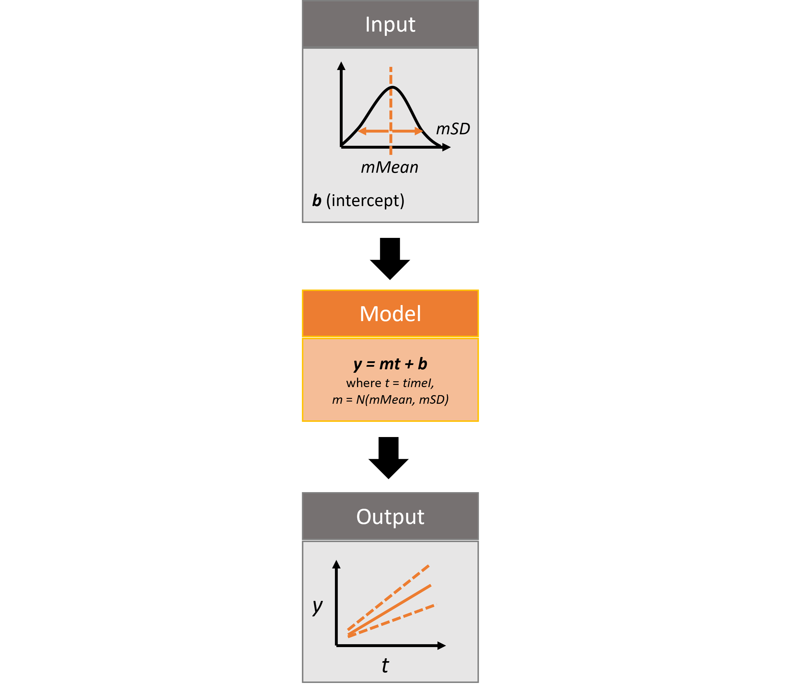

This vignette will cover Monte Carlo realizations for modeling uncertainty using the `rsyncrosim` package within the <a href="https://syncrosim.com/" target="_blank">SyncroSim</a> software framework. For an overview of <a href="https://syncrosim.com/" target="_blank">SyncroSim</a> and <a href="https://cran.r-project.org/web/packages/rsyncrosim/index.html" target="_blank">`rsyncrosim`</a>, as well as a basic usage tutorial for `rsyncrosim`, see the <a href="https://syncrosim.github.io/rsyncrosim/articles/a01_rsyncrosim_vignette_basic.html" target="_blank">Introduction to `rsyncrosim`</a> vignette.


## SyncroSim Package: `helloworldUncertainty`


To demonstrate how to quantify model uncertainty using the `rsyncrosim` interface, we will need the <a href="https://github.com/ApexRMS/helloworldUncertainty" target="_blank">helloworldUncertainty</a> SyncroSim package. `helloworldUncertainty` was designed to be a simple package for introducing iterations to SyncroSim modeling workflows. The use of iterations allows for repeated simulations, known as "Monte Carlo realizations", in which each simulation independently samples from a distribution of values.

The package takes from the user 3 inputs, *mMean*, *mSD*, and *b*. For each iteration, a value *m*, representing the slope, is sampled from a normal distribution with mean of *mMean* and standard deviation of *mSD*. The *b* value represents the intercept. These input values are run through a linear model, *y=mt+b*, where *t* is *time*, and the *y* value is returned as output.

{width=600px}

For more details on the different features of the `helloworldUncertainty` SyncroSim package, consult the SyncroSim <a href="https://docs.syncrosim.com/how_to_guides/package_create_iterations.html" target="_blank">Enhancing a Package: Representing Uncertainty</a> tutorial.


## Setup


### Install SyncroSim

Before using `rsyncrosim` you will first need to <a href="https://syncrosim.com/download/" target="_blank">download and install</a> the SyncroSim software. Versions of SyncroSim exist for both Windows and Linux.

### Installing and loading R packages

You will need to install the `rsyncrosim` R package, either using <a href="https://cran.r-project.org/" target="_blank">CRAN</a> or from the `rsyncrosim` <a href="https://github.com/syncrosim/rsyncrosim/releases/" target="_blank">GitHub repository</a>. Versions of `rsyncrosim` are available for both Windows and Linux.

In a new R script, load the `rsyncrosim` package.

```{r load packages}
# Load R package for working with SyncroSim
library(rsyncrosim)
```

### Connecting R to SyncroSim using `session()`

Finish setting up the R environment for the `rsyncrosim` workflow by creating a SyncroSim Session object. Use the `session()` function to connect R to your installed copy of the SyncroSim software.

```{r load session not run, warning = FALSE, eval = FALSE}
mySession <- session("path/to/install_folder")      # Create a Session based SyncroSim install folder
mySession <- session()                              # Using default install folder (Windows only)
mySession                                           # Displays the Session object
```

```{r load session run, warning = FALSE, eval = TRUE, echo = FALSE}
# Results of this code shown for above
mySession <- session()                              # Using default install folder (Windows only)
mySession                                           # Displays the Session object
```

Use the `version()` function to ensure you are using the latest version of SyncroSim.

```{r check version, warning = FALSE}
version(mySession)
```

### Installing SyncroSim packages using `addPackage()`

Install `helloworldUncertainty` using the `rynscrosim` function `addPackage()`. This function takes a package name as input and then queries the SyncroSim package server for the specified package.

```{r remove package from server run, warning=FALSE, include=FALSE}
installedPackages <- package()
if (is.element(
  "helloworldUncertainty", installedPackages$name)) removePackage(
    "helloworldUncertainty", force = TRUE)
```

```{r add package from server, warning = FALSE}
# Install helloworldUncertainty
addPackage("helloworldUncertainty")
```

`helloworldUncertainty` should now be included in the package list when we call the `package()` function:

```{r check packages 2, warning = FALSE, eval=FALSE}
# Get list of installed packages
package()
```

```{r check packages run, warning=FALSE, echo=FALSE}
uncertainty_pkg <- installedPackages[installedPackages$name == "helloworldUncertainty", ]
row.names(uncertainty_pkg) <- NULL
uncertainty_pkg
```


## Create a modeling workflow


When creating a new modeling workflow from scratch, we need to create objects of the following scopes:

* <a href="https://docs.syncrosim.com/how_to_guides/library_overview.html" target="_blank">Library</a>
* <a href="https://docs.syncrosim.com/how_to_guides/library_overview.html" target="_blank">Projects</a>
* <a href="https://docs.syncrosim.com/how_to_guides/library_overview.html" target="_blank">Scenarios</a>

For more information on these scopes, see the [Introduction to `rsyncrosim`](https://syncrosim.github.io/rsyncrosim/rsyncrosim_vignette_basic.html) vignette.

### Set up Library, Project, and Scenario

```{r create Library, warning = FALSE}
# Create a new Library
myLibrary <- ssimLibrary(name = "helloworldLibrary.ssim",
                         session = mySession,
                         package = "helloworldUncertainty",
                         overwrite = TRUE)

# Open the default Project
myProject = project(ssimObject = myLibrary, project = "Definitions")

# Create a new Scenario (associated with the default Project)
myScenario = scenario(ssimObject = myProject, scenario = "My first scenario")
```

### View model inputs using `datasheet()`
  
View the Datasheets associated with your new Scenario using the `datasheet()` function from `rsyncrosim`.

```{r view datasheet list, warning = FALSE}
# View all Datasheets associated with a Library, Project, or Scenario
datasheet(myScenario)
```

From the list of Datasheets above, we can see that there are three Datasheets specific to the `helloworldUncertainty` package. Let's view the contents of the input Datasheet as an R data frame.

```{r view specific datasheet, warning = FALSE}
# View the contents of the input Datasheet for the Scenario
datasheet(myScenario, name = "helloworldUncertainty_InputDatasheet")
```

### Configure model inputs using `datasheet()` and `addRow()`

**Input Datasheet**

Currently our input Scenario Datasheet is empty! We need to add some values to our input Datasheet (`InputDatasheet`) so we can run our model. First, assign the contents of the input Datasheet to a new data frame variable using `datasheet()`, then check the columns that need input values.

```{r assign input data, warning = FALSE}
# Load the input Datasheet to an R data frame
myInputDataframe <- datasheet(myScenario,
                              name = "helloworldUncertainty_InputDatasheet")

# Check the columns of the input data frame
str(myInputDataframe)
```

The input Datasheet requires three values:

* `mMean` : the mean of the slope normal distribution.
* `mSD` : the standard deviation of the slope normal distribution.
* `b` : the intercept of the linear equation.

Add these values to a new data frame, then use the `addRow()` function from `rsyncrosim` to update the input data frame.

```{r add input data not run, warning = FALSE}
# Create input data and add it to the input data frame
myInputRow <- data.frame(mMean = 2, mSD = 4, b = 3)
myInputDataframe <- addRow(myInputDataframe, myInputRow)

# Check values
myInputDataframe
```

Finally, save the updated R data frame to a SyncroSim Datasheet using `saveDatasheet()`.

```{r save input data, warning = FALSE}
# Save input R data frame to a SyncroSim Datasheet
saveDatasheet(ssimObject = myScenario, data = myInputDataframe,
              name = "helloworldUncertainty_InputDatasheet")
```

**RunControl Datasheet**

The `RunControl` Datasheet provides information about how many time steps and iterations to use in the model. Here, we set the *number of iterations*, as well as the minimum and maximum time steps for our model. The number of iterations we set is equivalent to the number of Monte Carlo realizations, so the greater the number of iterations, the more accurate the range of output values we will obtain. Let's take a look at the columns that need input values. 

```{r modify run control}
# Load RunControl Datasheet to a new R data frame
runSettings <- datasheet(myScenario, name = "helloworldUncertainty_RunControl")

# Check the columns of the RunControl data frame
str(runSettings)
```

The RunControl Datasheet requires the following 4 columns:

* `MinimumIteration` : starting value of iterations (default=1).
* `MaximumIteration` : total number of iterations to run the model for.
* `MinimumTimestep` : the starting time point of the simulation.
* `MaximumTimestep` : the end time point of the simulation.

We'll add this information to an R data frame and then add it to the Run Control data frame using `addRow()`. For this example, we will use only five iterations.

```{r}
# Create run control data and add it to the run control data frame
runSettingsRow <- data.frame(MinimumIteration = 1,
                             MaximumIteration = 5,
                             MinimumTimestep = 1,
                             MaximumTimestep = 10)
runSettings <- addRow(runSettings, runSettingsRow)

# Check values
runSettings
```

Finally, save the R data frame to a SyncroSim Datasheet using `saveDatasheet()`.

```{r}
# Save RunControl R data frame to a SyncroSim Datasheet
saveDatasheet(ssimObject = myScenario, data = runSettings,
              name = "helloworldUncertainty_RunControl")
```


## Run Scenarios

### Setting run parameters with `run()`

We will now run our Scenario using the `run()` function in `rsyncrosim`. If we have a large model and we want to parallelize the run using multiprocessing, we can set the `jobs` argument to be a value greater than one. Since we are using five iterations in our model, we will set the number of jobs to five so each multiprocessing core will run a single iteration.

```{r run first Scenario, warning = FALSE}
# Run the first Scenario we created
myResultScenario <- run(myScenario, jobs = 5)
```

Running the original Scenario creates a new Scenario object, known as a Results Scenario, that contains a read-only snapshot of the input Datasheets, as well as the output Datasheets filled with result data. We can view which Scenarios are Results Scenarios using the `scenario()` function from `rsyncrosim`.

```{r}
# Check that we have two Scenarios, and one is a Results Scenario
scenario(myLibrary)
```


## View results


### Viewing results with `datasheet()`

The next step is to view the output Datasheets added to the Result Scenario when it was run. We can load the result tables using the `datasheet()` function. In this package, the Datasheet containing the results is called "OutputDatasheet".


```{r view results datasheets, warning = FALSE}
# Results of first Scenario
resultsSummary <- datasheet(myResultScenario,
                            name = "helloworldUncertainty_OutputDatasheet")

# View results table
head(resultsSummary)
```

### Plotting uncertainty in the SyncroSim Windows User Interface

Now that we have run multiple iterations, we can visualize the uncertainty in our results. For this plot, we will plot the average *y* values over time, while showing the 20th and 80th percentiles.

To create a plot using the Results Scenario we just generated, open the current Library in the User Interface and sync the updates from `rsyncrosim` using the "refresh" button in the upper toolbar (circled in red below). All the updates made in `rsyncrosim` should appear in the User Interface. We can now add the Results Scenario to the Results Viewer and create our plot. For more information on generating plots in the User Interface, see the SyncroSim tutorials on <a href="http://docs.syncrosim.com/how_to_guides/results_chart_create.html" target="_blank">creating</a> and <a href="http://docs.syncrosim.com/how_to_guides/results_chart_customize.html" target="_blank">customizing</a> charts.

{width=600px}

