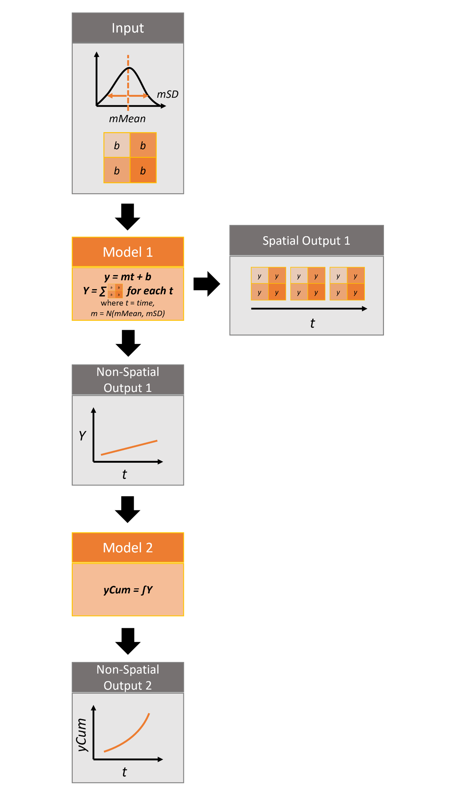

This vignette will cover incorporating spatial data into SyncroSim models using the `rsyncrosim` package within the <a href="https://syncrosim.com/" target="_blank">SyncroSim</a> software framework. For an overview of <a href="https://syncrosim.com/" target="_blank">SyncroSim</a> and <a href="https://cran.r-project.org/web/packages/rsyncrosim/index.html" target="_blank">`rsyncrosim`</a>, as well as a basic usage tutorial for `rsyncrosim`, see the <a href="https://syncrosim.github.io/rsyncrosim/articles/a01_rsyncrosim_vignette_basic.html" target="_blank">Introduction to `rsyncrosim`</a> vignette. To learn how to use iterations in the `rsyncrosim` interface, see the  <a href="https://syncrosim.github.io/rsyncrosim/articles/a02_rsyncrosim_vignette_uncertainty.html" target="_blank">`rsyncrosim`: introduction to uncertainty</a> vignette. To learn how to link models using pipelines in the `rsyncrosim` interface, see the <a href="https://syncrosim.github.io/rsyncrosim/articles/a03_rsyncrosim_vignette_pipelines.html" target="_blank">`rsyncrosim`: introduction to pipelines</a> vignette.


## SyncroSim Package: helloworldSpatial


To demonstrate how to use spatial data in the `rsyncrosim` interface, we will be using the <a href="https://github.com/ApexRMS/helloworldSpatial" target="_blank">helloworldSpatial</a> SyncroSim package. `helloworldSpatial` was designed to be a simple package to show off some key functionalities of SyncroSim, including the ability to use both spatial and non-spatial data.

The package takes 3 inputs, *mMean*, *mSD*, and a spatial raster file of intercept (*b*) values. For each iteration, a value *m*, representing the slope, is sampled from a normal distribution with mean of *mMean* and standard deviation of *mSD*. These values are run through 2 models to produce both spatial and non-spatial outputs.

{width=600px}

For more details on the different features of the `helloworldSpatial` SyncroSim package, consult the SyncroSim <a href="https://docs.syncrosim.com/how_to_guides/package_create_spatial.html" target="_blank">Enhancing a Package: Integrating Spatial Data</a> tutorial.


## Setup


### Install SyncroSim

Before using `rsyncrosim` you will first need to <a href="https://syncrosim.com/download/" target="_blank">download and install</a> the SyncroSim software. Versions of SyncroSim exist for both Windows and Linux.

*Note*: this tutorial was developed using `rsyncrosim` version 2.0. To use `rsyncrosim` version 2.0 or greater, SyncroSim version 3.0 or greater is required.

### Installing and loading R packages

You will need to install the `rsyncrosim` R package, either using <a href="https://cran.r-project.org/" target="_blank">CRAN</a> or from the `rsyncrosim` <a href="https://github.com/syncrosim/rsyncrosim/releases/" target="_blank">GitHub repository</a>. Versions of `rsyncrosim` are available for both Windows and Linux. You may need to install the `terra` package from CRAN as well.

In a new R script, load the necessary packages. This includes the `rsyncrosim` and `terra` R packages.

```{r load packages, message=FALSE, warning=FALSE}
# Load R packages
library(rsyncrosim)  # package for working with SyncroSim
library(terra)       # package for working with spatial data
```

### Connecting R to SyncroSim using `session()`

Finish setting up the R environment for the `rsyncrosim` workflow by creating a SyncroSim Session object. Use the `session()` function to connect R to your installed copy of the SyncroSim software.

```{r load session not run, warning = FALSE, eval = FALSE}
mySession <- session("path/to/install_folder")      # Create a Session based SyncroSim install folder
mySession <- session()                              # Using default install folder (Windows only)
mySession                                           # Displays the Session object
```

```{r load session run, warning = FALSE, echo = FALSE}
# Results of this code shown for above
mySession <- session()                              # Using default install folder (Windows only)
mySession                                           # Displays the Session object
```

Use the `version()` function to ensure you are using the latest version of SyncroSim.


```{r check version, warning = FALSE}
version(mySession)
```

### Installing SyncroSim packages using `installPackage()`

Install `helloworldSpatial` using the `rynscrosim` function `installPackage()`. This function takes a package name as input and then queries the SyncroSim package server for the specified package.

```{r remove package from server run, warning=FALSE, include=FALSE}
installedPackages <- packages()
if (is.element(
  "helloworldSpatial", installedPackages$name)) uninstallPackage(
    "helloworldSpatial")
```

```{r add package from server, warning = FALSE}
# Install helloworldSpatial
installPackage("helloworldSpatial")
```

`helloworldSpatial` should now be included in the package list returned by the `packages()` function in `rsyncrosim`:

```{r check packages 2, warning = FALSE, eval=FALSE}
# Get list of installed packages
packages()
```

```{r check packages run, warning=FALSE, echo=FALSE}
installedPackages <- packages()
spatial_pkg <- installedPackages[installedPackages$name == "helloworldSpatial", ]
row.names(spatial_pkg) <- NULL
spatial_pkg
```

## Create a modeling workflow


When creating a new modeling workflow from scratch, we need to create objects of the following scopes:

* <a href="https://docs.syncrosim.com/how_to_guides/library_overview.html" target="_blank">Library</a>
* <a href="https://docs.syncrosim.com/how_to_guides/library_overview.html" target="_blank">Projects</a>
* <a href="https://docs.syncrosim.com/how_to_guides/library_overview.html" target="_blank">Scenarios</a>

For more information on these scopes, see the [Introduction to `rsyncrosim`](https://syncrosim.github.io/rsyncrosim/rsyncrosim_vignette_basic.html) vignette.

### Set up library, project, and scenario

```{r delete library if it exists, echo = FALSE, message=FALSE}
if (file.exists("helloworldLibrary.ssim")){
  deleteLibrary("helloworldLibrary.ssim", force = TRUE)
}
```

```{r create Library, warning = FALSE}
# Create a new library
myLibrary <- ssimLibrary(name = "helloworldLibrary.ssim",
                         session = mySession,
                         package = "helloworldSpatial",
                         overwrite = TRUE)

# Open the default project
myProject = rsyncrosim::project(ssimObject = myLibrary, project = "Definitions")

# Create a new scenario (associated with the default project)
myScenario = scenario(ssimObject = myProject, scenario = "My spatial scenario")
```

### View model inputs using `datasheet()`
  
View the datasheets associated with your new scenario using the `datasheet()` function from `rsyncrosim`.

```{r view datasheet list, warning = FALSE}
# View all datasheets associated with a library, project, or scenario
datasheet(myScenario)
```

From the list of datasheets above, we can see that there are four datasheets specific to the `helloworldSpatial` package, including an `Inputs` datasheet, an `Intermediate Outputs` datasheet, an `Outputs` datasheet, and a `Run Control` datasheet.

### Configure model inputs using `datasheet()` and `addRow()`

Currently our input scenario datasheets are empty! We need to add some values to our `Inputs` datasheet, `Run Control` datasheet, and `Pipeline` datasheet so we can run our model.

**Inputs datasheet**

First, assign the contents of the `Inputs` datasheet to a new data frame variable using `datasheet()`, then check the columns that need input values.

```{r assign input data, warning = FALSE}
# Load Inputs datasheet to a new R data frame
myInputDataframe <- datasheet(myScenario,
                              name = "helloworldSpatial_InputDatasheet")

# Check the columns of the input data frame
str(myInputDataframe)
```

The `Inputs` datasheet requires three values:

* `mMean` : the mean of a normal distribution that will determine the slope of the linear equation.
* `mSD` : the standard deviation of a normal distribution that will determine the slope of the linear equation.
* `InterceptRasterFile` : the file path to a *raster image*, in which each cell of the image will be an intercept in the linear equation.

In this example, the external file we are using for the `InterceptRasterFile` is a simple 5x5 raster TIF file generated using the `raster` package in R. The file used in this vignette can be found <a href="https://github.com/ApexRMS/helloworldSpatial/blob/main/images/input-raster.tif" target="_blank">here</a>.


Add these values to a new data frame, then use the `addRow()` function from `rsyncrosim` to update the input data frame

```{r add input data not run, warning = FALSE}
# Create input data and add it to the input data frame
myInputRow <- data.frame(mMean = 0, 
                         mSD = 4,
                         InterceptRasterFile = "path/to/input-raster.tif")
myInputDataframe <- addRow(myInputDataframe, myInputRow)

# Check values
myInputDataframe
```

```{r add input data run, warning = FALSE, echo = FALSE, results = FALSE}
# Create input data and add it to the input data frame
myInputDataframe <- data.frame(
  mMean = 0, mSD = 4,
  InterceptRasterFile = "C:/gitprojects/rsyncrosim/vignettes/input-raster.tif")
```

Finally, save the updated R data frame to a SyncroSim datasheet using `saveDatasheet()`.

```{r save input data, warning = FALSE}
# Save input R data frame as a SyncroSim datasheet
saveDatasheet(ssimObject = myScenario, 
              data = myInputDataframe,
              name = "helloworldSpatial_InputDatasheet")
```

**Run Control datasheet**

The `Run Control` datasheet sets the number of iterations and the minimum and maximum time steps for our model. We'll assign the contents of this datasheet to a new data frame variable as well and then add then update the information in the data frame using `addRow()`. We need to specify data for the following four columns:

* `MaximumIteration` : total number of iterations to run the model for.
* `MinimumTimestep` : the starting time point of the simulation.
* `MaximumTimestep` : the end time point of the simulation.

*Note:* A fourth hidden column, `MinimumIteration`, also exists in the `Run Control` datasheet (default=1).

```{r modify Run Control}
# Load Run Control datasheet to an R data frame
runSettings <- datasheet(myScenario, name = "helloworldSpatial_RunControl")

# Check the columns of the Run Control data frame
str(runSettings)

# Create Run Control data and add it to the Run Control data frame
runSettingsRow <- data.frame(MaximumIteration = 5,
                             MinimumTimestep = 1,
                             MaximumTimestep = 10)

runSettings <- addRow(runSettings, runSettingsRow)

# Check values
runSettings

# Save Run Control R data frame to a SyncroSim datasheet
saveDatasheet(ssimObject = myScenario, 
              data = runSettings,
              name = "helloworldSpatial_RunControl")
```

**Pipeline datasheet**

The `helloworldSpatial` package uses pipelines to link the output of one model to the input of a second model. To learn more about pipelines, see the [`rsyncrosim`: introduction to pipelines](https://syncrosim.github.io/rsyncrosim/rsyncrosim_vignette_pipelines.html) vignette and the SyncroSim <a href="https://docs.syncrosim.com/how_to_guides/package_create_pipelines.html" target="_blank">Enhancing a Package: Linking Models</a> tutorial.

To implement pipelines in our package, we need to specify the order in which to run the transformers (i.e. models) in our pipeline by editing the `Pipeline` datasheet. The `Pipeline` datasheet is part of the built-in SyncroSim core, so we access it using the "core_" prefix with the `datasheet()` function. 

From viewing the structure of the `Pipeline` datasheet we know that the `StageNameId` is a factor with two levels: 

* Hello World Spatial 1 (R)
* Hello World Spatial 2 (R)

We will set the data for this datasheet such that `Hello World Spatial 1 (R)` is run first, then `Hello World Spatial 2 (R)`. This way, the output from `Hello World Spatial 1 (R)` is used as the input for `Hello World Spatial 2 (R)`.

```{r modify pipeline}
# Load Pipeline datasheet to an R data frame
myPipelineDataframe <- datasheet(myScenario, name = "core_Pipeline")

# Check the columns of the Pipeline data frame
str(myPipelineDataframe)

# Create Pipeline data and add it to the Pipeline data frame
myPipelineRow <- data.frame(StageNameId = c("Hello World Spatial 1 (R)", 
                                            "Hello World Spatial 2 (R)"),
                            RunOrder = c(1, 2))

myPipelineDataframe <- addRow(myPipelineDataframe, myPipelineRow)

# Check values
myPipelineDataframe

# Save Pipeline R data frame to a SyncroSim datasheet
saveDatasheet(ssimObject = myScenario, data = myPipelineDataframe,
              name = "core_Pipeline")
```


## Run scenarios

### Setting run parameters with `run()`

We will now run our scenario using the `run()` function in `rsyncrosim`. 

If we have a large model and we want to parallelize the run using multiprocessing, we can modify the library-scoped "core_Multiprocessing" datasheet. Since we are using five iterations in our model, we will set the number of jobs to five so each multiprocessing core will run a single iteration.

```{r}
# Load list of available library-scoped datasheets
datasheet(myLibrary)

# Load the library-scoped multiprocessing datasheet
multiprocess <- datasheet(myLibrary, name = "core_Multiprocessing")

# Check required inputs
str(multiprocess)

# Enable multiprocessing
multiprocess$EnableMultiprocessing <- TRUE

# Set maximum number of jobs to 5
multiprocess$MaximumJobs <- 5

# Save multiprocessing configuration
saveDatasheet(ssimObject = myLibrary, 
              data = multiprocess, 
              name = "core_Multiprocessing")
```

Now, when we run our scenario, it will use the desired multiprocessing configuration.

```{r run first Scenario, warning = FALSE}
# Run the first scenario we created
myResultScenario <- run(myScenario)
```

After the scenario has been run, a results scenario is created that contains results in the output datasheets.

## View results

The next step is to view the output datasheets added to the result scenario when it was run.

### Viewing non-spatial results with `datasheet()`

First, we will view the non-spatial results within the results scenarios. For each step in the pipeline, We can load the result tables using the `datasheet()` function.


```{r view results datasheets, warning = FALSE, eval = FALSE, results = FALSE}
# Load results of first transformer in the pipeline
resultsSummary <- datasheet(myResultScenario,
                            name = "helloworldSpatial_IntermediateDatasheet")

# View results table of first transformer in the pipeline
head(resultsSummary)
```

```{r resultsSummary cleaned, echo = FALSE}
# Results of the first model in the pipeline
resultsSummary <- datasheet(myResultScenario,
                            name = "helloworldSpatial_IntermediateDatasheet")

resultsSummary$OutputRasterFile <- sub(
  ".*\\\\", "", resultsSummary$OutputRasterFile
  )

head(resultsSummary)
```

```{r view results summary 2, warning = FALSE}
# Load results of second transformer in the pipeline
resultsSummary2 <- datasheet(myResultScenario,
                             name = "helloworldSpatial_OutputDatasheet")

# View results table of second transformer in the pipeline
head(resultsSummary2)
```

From viewing these datasheets, we can see that the spatial output is contained within the `IntermediateDatasheet`, in the column called `OutputRasterFile`.


### Viewing spatial results with `datasheetSpatRaster()`

For spatial results, we want to load the results as raster images. To do this, we will use the `datasheetSpatRaster()` function from `rsyncrosim`. The first argument is the *result scenario* object. Next, we specify the name of the datasheet containing raster images using the `datasheet` argument, and the column pertaining to the raster images using the `column` argument. The results contain many raster images, since we have a raster for each combination of iteration and timestep. We can use the `iteration` and `timestep` arguments to specify a single raster image or a subset of raster images we want to view. 

```{r view results raster, warning = FALSE}
# Load raster files for first result scenario with timestep and iteration
rasterMaps <- datasheetSpatRaster(
  myResultScenario,
  datasheet = "helloworldSpatial_IntermediateDatasheet",
  column = "OutputRasterFile",
  iteration = 1,
  timestep = 5
  )

# View results
rasterMaps
plot(rasterMaps[[1]])
```

### Viewing spatial results in SyncroSim Studio

To create maps using the results scenario we just generated, open the current library in SyncroSim Studio and sync the updates from `rsyncrosim` using the "refresh" button in the upper toolbar (circled in red below). All the updates made in `rsyncrosim` should appear in SyncroSim Studio. We can now add the results scenario to the Results Viewer and create our maps. For more information on generating map in SyncroSim Studio, see the SyncroSim tutorials on <a href="http://docs.syncrosim.com/how_to_guides/results_map_create.html" target="_blank">creating</a> and <a href="http://docs.syncrosim.com/how_to_guides/results_map_customize.html" target="_blank">customizing</a> maps

{width=600px}
