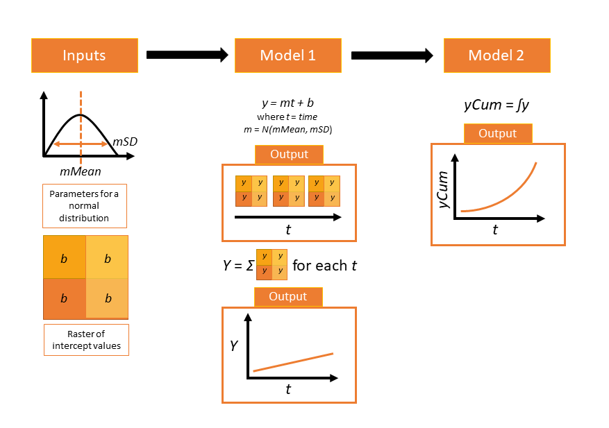

This vignette will cover the basics of using the `rsyncrosim` package within the <a href="https://syncrosim.com/" target="_blank">SyncroSim</a> software framework. Specifically, we will cover the following topics:

* [Overview of SyncroSim](#overview-of-syncroSim)
* [Overview of rsyncrosim](#overview-of-rsyncrosim)
* [Package: helloworldEnhanced](#package-helloworldenhanced)
* [Setup](#setup)
* [Create a model](#create-a-model)
* [Edit a model](#edit-a-model)
* [Run a model](#run-a-model)
* [View results](#view-results)
* [Access model metadata](#access-model-metadata)
* [Backup your Library](#backup-your-ibrary)


## Overview of SyncroSim


<a href="https://syncrosim.com/" target="_blank">SyncroSim</a> is a software platform that helps you turn your *data* into *forecasts*. At the core of SyncroSim is an engine that automatically structures your existing data, regardless of its original format. SyncroSim transforms this structured data into forecasts by running it through a Pipeline of calculations (i.e. a suite of *models*). Finally, SyncroSim  provides a rich interface to interact with your data and models, allowing you to explore and track the consequences of alternative "what-if" forecasting scenarios. Within this software framework is the ability to use and create <a href="https://docs.syncrosim.com/how_to_guides/package_overview.html" target="_blank">SyncroSim packages</a>.  

For more details consult the SyncroSim <a href="https://docs.syncrosim.com/" target="_blank">online documentation</a>.


## Overview of rsyncrosim


`rsyncrosim` is an R package designed to facilitate the development of modeling workflows for the <a href="https://syncrosim.com/" target="_blank">SyncroSim</a> software framework. Using the `rsyncrosim` interface, simulation models can be added and run through SyncroSim to transform scenario-based datasets into model forecasts. This R package takes advantage of general features of SyncroSim, such as defining scenarios with spatial or non-spatial inputs, running Monte Carlo simulations, and summarizing model outputs. `rsyncrosim` requires SyncroSim 2.2.13 or higher.

For more details consult the `rsyncrosim` <a href="https://cran.r-project.org/web/packages/rsyncrosim/index.html" target="_blank">CRAN documentation</a>.

## SyncroSim Package: helloworldEnhanced


To demonstrate the utility of the `rsyncrosim` interface, we will be using the <a href="https://github.com/ApexRMS/helloworldEnhanced" target="_blank">helloworldEnhanced</a> SyncroSim package. `helloworldEnhanced` was designed to be a simple package to show off some key functionalities of SyncroSim, including the ability to use timesteps, Monte Carlo realizations, both spatial and non-spatial data, and pipelines to link sequential models.

The package takes 3 inputs, including a spatial raster file, from the user and runs these values through 2 models to produce outputs. The package also includes the ability to use iterations, so the user can run the pipeline of models multiple times to get a measure of uncertainty.



For more details on the different features of the `helloworldEnhanced` SyncroSim package, consult the SyncroSim <a href="https://docs.syncrosim.com/how_to_guides/package_create_timesteps.html" target="_blank">Enhancing a Package tutorial</a>.


## Setup


### Install SyncroSim

Before using `rsyncrosim` you will first need to <a href="https://syncrosim.com/download/" target="_blank">download and install</a> the SyncroSim software. Versions of SyncroSim exist for both Windows and Linux.

### Installing and loading R packages

You will need to install the `rsyncrosim` R package, either using <a href="https://cran.r-project.org/" target="_blank">CRAN</a> or from the `rsyncrosim` <a href="https://github.com/syncrosim/rsyncrosim/releases/" target="_blank">GitHub repository</a>. Versions of `rsyncrosim` are available for both Windows and Linux.

In a new R script, load the necessary packages. This includes the `rsyncrosim`, `raster`, and `this.path` R packages. You may need to install the `raster` and `rgdal` packages from CRAN as well.

```{r load packages, warning = FALSE, message = FALSE}
# Load R packages
library(rsyncrosim)  # package for working with SyncroSim
library(raster)      # package for working with raster data
```

### Installing SyncroSim packages using `addPackage()`

Check if the <a href="https://github.com/ApexRMS/helloworldEnhanced" target="_blank">helloworldEnhanced</a> package is already installed. Use the `package()` function from `rsyncrosim` to first get a list of all currently installed packages in SyncroSim.

```{r delete SyncroSim packages, echo = FALSE, results = FALSE, message = FALSE}
if (is.element("demosales", package()$name)) removePackage("demosales", force = TRUE)
if (is.element("dgsim", package()$name)) removePackage("dgsim", force = TRUE)
if (is.element("epi", package()$name)) removePackage("epi", force = TRUE)
if (is.element("helloworld", package()$name)) removePackage("helloworld", force = TRUE)
if (is.element("helloworldEnhanced", package()$name)) removePackage("helloworldEnhanced", force = TRUE)
if (is.element("landfirevegmodels", package()$name)) removePackage("landfirevegmodels", force = TRUE)
if (is.element("stsim", package()$name)) removePackage("stsim", force = TRUE)
if (is.element("stsimsf", package()$name)) removePackage("stsimsf", force = TRUE)
```


```{r check packages 1, warning = FALSE}
# Get list of installed packages
package()
```

Currently we do not have any packages installed! Install `helloworldEnhanced` using the `rynscrosim` function `addPackage()`. This function takes a package name as input and then queries the SyncroSim package server for the specified package.

```{r add package from server, warning = FALSE, eval = FALSE}
# Install helloworldEnhanced
addPackage("helloworldEnhanced")
```

To install the package from a `.ssimpkg` file on your local computer rather than installing directly from the server, you can use the `addPackage()` function with the `filepath` argument set to `TRUE`. Instead of using the package name as the argument, the file path to the `.ssimpkg` is used.

```{r add package from path not run, warning = FALSE, eval = FALSE}
# Install helloworldEnhanced using file path to ssimpkg file
addPackage("path/to/helloworldEnhanced.ssimpkg",
           filepath = TRUE)
```

```{r add package from path run, echo = FALSE, results = FALSE, message = FALSE}
addPackage("c:\\Users\\birch\\OneDrive\\Desktop\\install\\helloworldEnhanced.ssimpkg",
           filepath = TRUE)
```

Now `helloworldEnhanced` should now be included in the package list:

```{r check packages 2, warning = FALSE}
# Get list of installed packages
package()
```


*Note:* you can also update installed packages using the `updatePackage()` function or delete installed packages using the `removePackage()` function in `rsyncrosim`

### Connecting R to SyncroSim using `session()`

The final step in setting up the R environment for the `rsyncrosim` workflow is to create a SyncroSim Session object in R that provides the connection to your installed copy of the SyncroSim software. A new Session is created using the `session()` function, in which the first argument is a path to the folder on your computer where SyncroSim has been installed. If the first argument is left blank, then the default install folder is used (Windows only).

```{r load session not run, warning = FALSE, eval = FALSE}
mySession <- session("path/to/install_folder")      # Create a Session based SyncroSim install folder
mySession <- session()                              # Using default install folder (Windows only)
mySession                                           # Displays the Session object
```

```{r load session run, echo = FALSE}
mySession <- session()
mySession
```


You can check to see which version of SyncroSim your R script is connected to by running the `version()` function.

```{r check version, warning = FALSE}
version(mySession)
```


## Create a modeling workflow


When creating a new modeling workflow from scratch, we need to create objects of the following scopes:

* <a href="https://docs.syncrosim.com/how_to_guides/library_overview.html" target="_blank">Library</a>
* <a href="https://docs.syncrosim.com/how_to_guides/library_overview.html" target="_blank">Projects</a>
* <a href="https://docs.syncrosim.com/how_to_guides/library_overview.html" target="_blank">Scenarios</a>

These objects are hierarchical, such that a Library can contain many projects, and each Project can contain many scenarios. All parameters or configurations set in a Library are inherited by all projects within the Library, and all parameters or configurations set in a Project are inherited by all scenarios within that Project. See below for further information on these model objects.

### Create a new library using `ssimLibrary()`

A SyncroSim <a href="https://docs.syncrosim.com/how_to_guides/library_overview.html" target="_blank">Library</a> is a file (with `.ssim` extension) that stores all of your model inputs and outputs. The format of each SyncroSim Library is unique to the SyncroSim Package with which it is associated. We use the `ssimLibrary()` function to create a new SsimLibrary object in R that is connected (through your Session) to a SyncroSim Library file. We can also use the `ssimLibrary()` function to open an existing Library. Note that if you want to create a new Library file with an existing Library name rather than opening the existing Library, you can use `overwrite=TRUE` for the `ssimLibrary()` function.

```{r create library, warning = FALSE}
# Create a new library
myLibrary <- ssimLibrary(name = "helloworldLibrary.ssim",
                         session = mySession,
                         package = "helloworldEnhanced")

# Check library information
myLibrary
```

### Open a project using `project()`

Each SyncroSim Library contains one or more SyncroSim <a href="https://docs.syncrosim.com/how_to_guides/library_overview.html" target="_blank">Projects</a>, each represented by a Project object in R. Projects typically store model inputs that are common to all your scenarios. In most situations you will need only a single Project for your Library; by default each new Library starts with a single Project named "Definitions" (with a unique `projectId`= 1). The `project()` function is used to both create and retrieve Projects. Note that the `ssimObject` here can be the name of a Library or Scenario.

```{r open project, warning = FALSE}
# Open existing project
myProject = project(ssimObject = myLibrary, project = "Definitions")  # Using name for Project
myProject = project(ssimObject = myLibrary, project = 1)              # Using projectId for Project

# Check project information
myProject
```


### Create a new scenario using `scenario()`

Finally, each SyncroSim Project contains one or more <a href="https://docs.syncrosim.com/how_to_guides/library_overview.html" target="_blank">Scenarios</a>, each represented by a Scenario object in R. Scenarios store the specific model inputs and outputs associated with each model run in SyncroSim. Scenarios can contain multiple models connected by a series of Pipelines, such that the output of one model becomes the input of the next. Each Scenario can be identified by its unique `scenarioId`. The `scenario()` function is used to both create and retrieve Scenarios. Note that the `ssimObject` here can be the name of a Library or a Project.

```{r create scenario, warning = FALSE}
# Create a new scenario (associated with the default Project)
myScenario = scenario(ssimObject = myProject, scenario = "My first scenario")

# Check scenario information
myScenario
```

### View model inputs using `datasheet()`
  
Each SyncroSim Library contains multiple SyncroSim <a href="https://docs.syncrosim.com/how_to_guides/properties_overview.html" target="_blank">Datasheets</a>. A SyncroSim Datasheet is simply a table of data stored in the Library. Datasheets each have a *scope*: either <a href="https://docs.syncrosim.com/how_to_guides/library_overview.html" target="_blank">Library</a>, 
<a href="https://docs.syncrosim.com/how_to_guides/library_overview.html" target="_blank">Project</a>, or 
<a href="https://docs.syncrosim.com/how_to_guides/library_overview.html" target="_blank">Scenario</a>. We can view Datasheets of varying scopes using the `datasheet()` function from `rsyncrosim`.

```{r view datasheet list, warning = FALSE}
# View all Datasheets associated with a library, project, or scenario
datasheet(myScenario)
```

To view a specific Datasheet rather than just a data frame of available Datasheets, set the `name` parameter in the `datasheet()` function to the name of the Datasheet you want to view. The general syntax of the name is: "\<name of package\>_\<name of Datasheet\>". From the list of Datasheets above, we can see that there are 4 Datasheets specific to the `helloworldEnhanced` package.

```{r view specific datasheet, warning = FALSE}
# View the input Datasheet for the scenario
datasheet(myScenario, name = "helloworldEnhanced_InputDatasheet")
```

Here, we are viewing a SyncroSim Datasheet as an R data frame. Although both SyncroSim Datasheets and R data frames are both represented as tables of data with predefined columns and an unlimited number of rows, the underlying structure of these tables differ.

### Configure model inputs using `datasheet()` and `addRow()`

Currently our input scenario Datasheets are empty! We need to add some values to our input Datasheet (`InputDatasheet`) so we can run our model. First, assign the input Datasheet to a new data frame variable.

```{r assign input data, warning = FALSE}
# Assign input Datasheet to a new data frame variable
myInputDataframe <- datasheet(myScenario,
                              name = "helloworldEnhanced_InputDatasheet")
```

Now, check the columns that need input values and the type of values these columns require (e.g. string, numeric, logical) using the `str()` base R function.

```{r check input data, warning = FALSE}
# Check the columns of the input data frame
str(myInputDataframe)
```

The input Datasheet requires 3 values:

* `mMean` : the mean of a normal distribution that will determine the slope of the linear equation.
* `mSD` : the standard deviation of a normal distribution that will determine the slope of the linear equation.
* `InterceptRasterFileName` : the file path to a raster image, in which each cell of the image will be an intercept in the linear equation.

We can add these values to a new data frame, then use the `addRow()` function from `rsyncrosim` to update the input Datasheet. The `addRow()` function takes the `targetDataframe` as the first value (in this case, our input Datasheet that we want to update), and the new rows to append to this data frame as the second value.

```{r add input data not run, warning = FALSE, eval = TRUE}
# Create input data and add it to the input data frame
myInputRow <- data.frame(mMean = 0, mSD = 4,
                         InterceptRasterFileName = "path/to/raster-image.tif")
myInputDataframe <- addRow(myInputDataframe, myInputRow)

# Check values
myInputDataframe
```

```{r add input data run, warning = FALSE, echo = FALSE}
# Create input data and add it to the input data frame
myInputDataframe <- data.frame(
  mMean = 0, mSD = 4,
  InterceptRasterFileName = "C:\\gitprojects\\helloworldEnhanced\\step5_Spatial\\input-raster.tif")
```

### Saving modifications to Datasheets using `saveDatasheet()`

Now that we have added values to the input Datasheet, we will save our updated Datasheet to the Library, Project, and/or Scenario using the `saveDatasheet()` function.

```{r save input data, warning = FALSE}
# Save input R data frame as a SyncroSim Datasheet
saveDatasheet(ssimObject = myScenario, data = myInputDataframe,
              name = "helloworldEnhanced_InputDatasheet")
```

### Configuring values for the remaining Datasheets

There are a couple other Datasheets that we need to configure for our package to run. First, the `RunControl` Datasheet provides information about how many time steps and iterations to use. Second, the `Pipeline` Datasheet from the built-in SyncroSim Core specifies which models (i.e. SyncroSim Transformers) should be run in which order.

**`RunControl` Datasheet**

We need to set the number of iterations and the minimum and maximum time steps for our model. We'll add this information to an R data frame as well and then add it to the Run Control Datasheet using `addRow()`. We need to specify data for the following 4 columns:

* `MinimumIteration` : starting value of iterations (default=1).
* `MaximumIteration` : total number of iterations to run the model for.
* `MinimumTimestep` : the starting time point of the simulation.
* `MaximumTimestep` : the end time point of the simulation.

```{r modify run control}
# Assign run control Datasheet to a new data frame variable
runSettings <- datasheet(myScenario, name = "helloworldEnhanced_RunControl")

# Check the columns of the run control data frame
str(runSettings)

# Create run control data and add it to the run control data frame
runSettingsRow <- data.frame(MinimumIteration = 1,
                             MaximumIteration = 5,
                             MinimumTimestep = 1,
                             MaximumTimestep = 10)
runSettings <- addRow(runSettings, runSettingsRow)

# Check values
runSettings

# Save run control R data frame as a SyncroSim Datasheet
saveDatasheet(ssimObject = myScenario, data = runSettings,
              name = "helloworldEnhanced_RunControl")
```

**`Pipeline` Datasheet**

Finally, we need to specify the order in which to run the two models in our Pipeline by editing the Pipeline Datasheet. The Pipeline Datasheet is part of the built-in SyncroSim core. To access the core datasheets, we must add the argument `summary = "CORE"`. From viewing the structure of the Pipeline Datasheet we know that the `StageNameID` is a factor with 2 levels: "First Model" and "Second Model". We will set the data for this Datasheet such that "First Model" is run first, and then "Second Model".

```{r modify pipeline}
# Assign Pipeline Datasheet to a new data frame variable
myPipelineDataframe <- datasheet(myScenario, name = "core_Pipeline",
                                 summary = "CORE")

# Check the columns of the Pipeline data frame
str(myPipelineDataframe)

# Create Pipeline data and add it to the Pipeline data frame
myPipelineRow <- data.frame(StageNameID = c("First Model", "Second Model"),
                            RunOrder = c(1, 2))

myPipelineDataframe <- addRow(myPipelineDataframe, myPipelineRow)

# Check values
myPipelineDataframe

# Save Pipeline R data frame as a SyncroSim Datasheet
saveDatasheet(ssimObject = myScenario, data = myPipelineDataframe,
              name = "core_Pipeline")
```


## Edit Scenarios


You may want to test multiple alternative scenarios that have slightly different inputs. To save time, you can copy a scenario that you've already made, give it a different name, and modify the inputs. To copy a completed scenario, use the `scenario()` function with the `sourceScenario` argument set to the name of the scenario you want to copy.

```{r create new scenario from source, warning = FALSE}
# Check which scenarios you currently have in your library
scenario(myLibrary)['name']

# Create a new scenario based off an old scenario
myNewScenario <- scenario(ssimObject = myProject,
                          scenario = "My second scenario",
                          sourceScenario = myScenario)

# Make sure this new scenario has been added to the library
scenario(myLibrary)['name']
```


To edit the new scenario, we must first load the Datasheet and assign it to a new variable using the `datasheet()` function. We will set the `empty` argument to `TRUE` so that instead of getting the values from the old scenario, we can add a data frame of new values.

```{r load input data from new scenario, warning = FALSE}
# Load empty input Datasheets as an R data frame
myNewInputDataframe <- datasheet(myNewScenario,
                              name = "helloworldEnhanced_InputDatasheet",
                              empty=TRUE)

# Check that we have an empty data frame
str(myNewInputDataframe)
```

Now, all we need to do is add our data frame of values the same way we did before, using the `addRow()` function.

```{r edit input data for new scenario not run, warning = FALSE}
# Create input data and add it to the input data frame
newInputRow <- data.frame(mMean = 2, mSD = 8,
                          InterceptRasterFileName = "path/to/raster-image.tif")
myNewInputDataframe <- addRow(myNewInputDataframe, newInputRow)

# View the new inputs
myNewInputDataframe
```

```{r edit input data for new scenario run, warning = FALSE, echo = FALSE}
# Create input data and add it to the input data frame
myNewInputDataframe <- data.frame(
  mMean = 2, mSD = 8,
  InterceptRasterFileName = "C:\\gitprojects\\helloworldEnhanced\\step5_Spatial\\input-raster.tif")
```

Finally, we will save the updated data frame to a SyncroSim Datasheet using `saveDatasheet()`.

```{r save new scenario, warning = FALSE}
# Save R data frame to a SyncroSim Datasheet
saveDatasheet(ssimObject = myNewScenario, data = myNewInputDataframe,
              name = "helloworldEnhanced_InputDatasheet")
```

## Run Scenarios

### Setting run parameters with `run()`

We will now run our scenarios using the `run()` function in `rsyncrosim`, starting with the first scenario we created ("My first scenario").

```{r run first scenario, warning = FALSE}
# Run the first scenario we created
myResultScenario <- run(myScenario)

# Check class of myResultScenario
class(myResultScenario)
```

If we have a large model and we want to parallelize the run using multiprocessing, we can set the `jobs` argument to be a value greater than 1.

```{r run with multiprocessing, warning = FALSE}
# Set jobs > 1 for multiprocessing 
myResultsScenario <- run(myScenario, jobs = 6)
```

Another useful argument of the `run()` function is `summary`. When set to `TRUE` it will return results scenario IDs rather than results scenario objects. By default, it is set to `FALSE`.

```{r run with summary, warning = FALSE}
# Run the first scenario we created with summary = TRUE
myResultScenario <- run(myScenario, summary = TRUE)

# Check class of myResultScenario
class(myResultScenario)
```

We can also tell SyncroSim to run all the scenarios in our project at once. Instead of passing a single scenario to the `run()` function, we will tell `run()` which project to use and include a vector of scenarios.

```{r run multiple scenarios, warning = FALSE}
# Run all scenarios
myResultScenarioAll <- run(myProject,
                           scenario = c("My first scenario",
                                        "My second scenario"))
```

### Checking the run log with `runLog()`

For more information use the `runLog()` function, in which the only argument is the result scenario variable.

```{r get run log, warning = FALSE}
# Get run details for each of our result scenarios
runLog(myResultScenarioAll[[1]])
```


## View results


### Viewing non-spatial results with `datasheet()`

The next step is to view the result scenarios. We can load the result tables using the `datasheet()` function.


```{r view results datasheets, warning = FALSE}
# Results of first scenario, first model of first model in Pipeline
resultsSummary <- datasheet(myResultScenarioAll[[1]],
                            name = "helloworldEnhanced_IntermediateDatasheet")

# View results table of first model in Pipeline
head(resultsSummary)

# Results of first scenario, second model in Pipeline
resultsSummary2 <- datasheet(myResultScenarioAll[[1]],
                             name = "helloworldEnhanced_OutputDatasheet")

# View results table of second model in Pipeline
head(resultsSummary2)
```

### Viewing spatial results with `datasheetRaster()`

For spatial results, we want to load the results as raster images. To do this, we will use the `datasheetRaster()` function from `rsyncrosim`. The results contain many raster images, since we have a raster for each combination of iteration and time step. We can use the `iteration` and `timestep` arguments to specify a single raster image or a subset of raster images we want to view. Since we have multiple parent scenarios, we also need to specify the parent scenario using the `scenario` argument.

```{r view results raster, warning = FALSE}
# Load raster files for first result scenario with time step and iteration
rasterMaps <- datasheetRaster(
  myResultScenarioAll,
  scenario = "My second scenario",
  datasheet = "helloworldEnhanced_IntermediateDatasheet",
  column = "InterceptRasterFileName",
  iteration = 1,
  timestep = 5
  )

# View results
rasterMaps
plot(rasterMaps[[1]])
```

### Identifying the parent scenario of a result scenario using `parentId()`

If you have many alternative scenarios and many results scenarios, you can always find the parent scenario that led to a result scenario using the `rsyncrosim` function `parentId()`.

```{r get parent ID, warning = FALSE}
parentId(myResultScenarioAll[[1]])
parentId(myResultScenarioAll[[2]])
```


## Access model metadata


### Getting library information using `info()`

Retrieve library information:
  
```{r library metadata, warning = FALSE}
info(myLibrary)
```

### Getting information of any ssimObject

The following functions can be used to get useful information about a Library, Project, or Scenario:

* `name()` : used to retrieve or assign a name
* `owner()` : used to retrieve or assign an owner
* `dateModified()` : used to retrieve the date when the last changes were made
* `readOnly()` : used to retrieve or assign the read only status
* `filepath()` : retrieve local file path
* `description()` : retrieve or add a description

You can also find identification numbers of projects or scenarios using the following functions:

* `projectID()` : used to retrieve the project identification number
* `scenarioID()` : used to retrieve the scenario identification number

## Backup your Library

Once you have finished running your models, you may want to back up the inputs and results into a zipped .backup subfolder. First, we want to modify the Library Backup Datasheet to allow the backup of model outputs. Since this Datasheet is part of the built-in SyncroSim core, the name of the Datasheet has the prefix "core" and we must use the `summary = "CORE"` argument when loading it.

```{r backup library, warning = FALSE}
# Get the current values for the Library's Backup Datasheet
sheetData <- datasheet(myLibrary, name = "core_Backup", summary = "CORE")   

# View current values for the Library's Backup Datasheet
sheetData

# Add output to the Library's Backup Datasheet and save
sheetData$IncludeOutput <- TRUE 
saveDatasheet(myLibrary, data = sheetData, name = "core_Backup")

# Check to make sure IncludeOutput is now TRUE
datasheet(myLibrary, "core_Backup", summary = "CORE")
```

Now, you can use the `backup()` function from `rsyncrosim` to backup a Library, Project, or Scenario.

```{r, warning = FALSE, eval = FALSE}
backup(myLibrary)
```
